# Chinese Chess (Xiangqi) iPhone Application - Design Document

## Overview

This design document outlines the technical architecture and implementation details for a Chinese Chess (Xiangqi) iPhone application. The app provides real-time online multiplayer gameplay with device-based anonymous authentication, turn timeout management, move rollback functionality, and comprehensive match history tracking.

### Design Goals

1. **Seamless User Experience**: Anonymous play without account creation friction
2. **Real-Time Gameplay**: Sub-500ms move synchronization between players
3. **Authentic Xiangqi**: Complete implementation of traditional Chinese Chess rules
4. **Reliability**: Robust handling of network issues and game state preservation
5. **Scalability**: Architecture supporting 1000+ simultaneous games
6. **Maintainability**: Clean MVVM architecture with clear separation of concerns

### Scope

- iOS client application (SwiftUI + Combine)
- Backend server architecture (REST API + WebSocket)
- SQLite local database with server synchronization
- Complete Xiangqi rules engine

---

## Architecture Design

### System Architecture Diagram

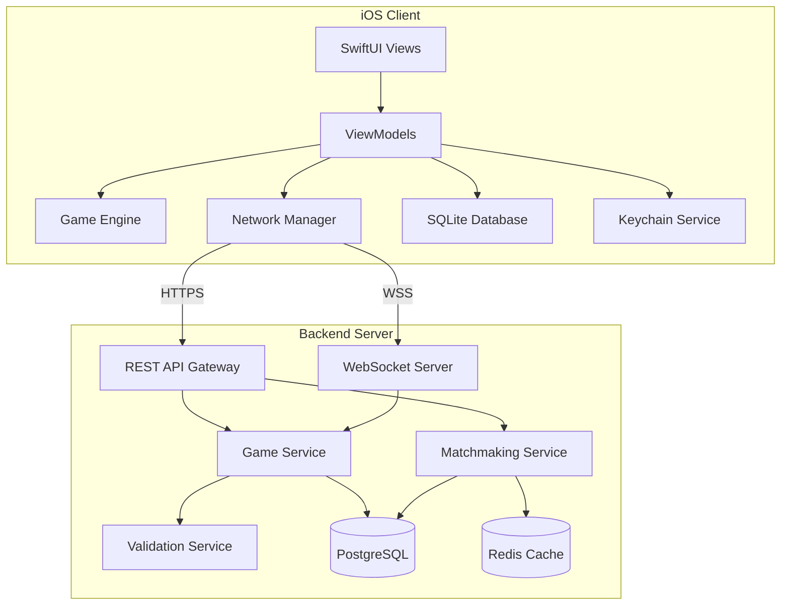

### Client Architecture (MVVM)

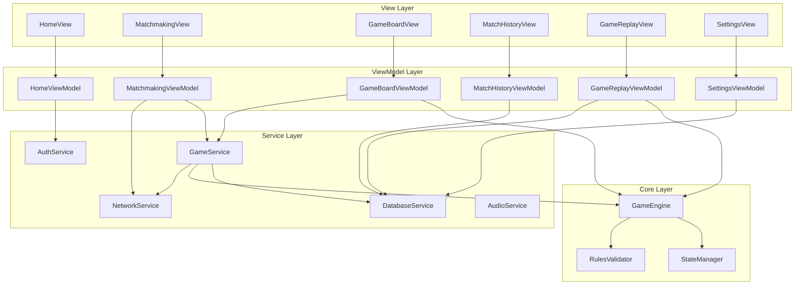

### Data Flow Diagram

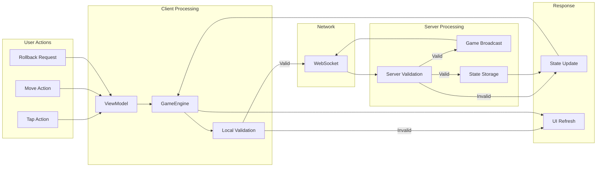

---

## Component Design

### 1. Authentication Component

**Responsibilities:**
- Generate and store device identifier (IDFV)
- Manage Keychain storage for persistent identity
- Generate default display names
- Validate display name changes

**Interfaces:**
```swift
protocol AuthServiceProtocol {
    var currentDeviceId: String? { get }
    var currentDisplayName: String { get }

    func initialize() async throws -> DeviceIdentity
    func updateDisplayName(_ name: String) async throws -> Bool
    func validateDisplayName(_ name: String) -> DisplayNameValidationResult
}
```

**Dependencies:**
- Keychain Services (Security framework)
- NetworkService (for server registration)

---

### 2. Game Engine Component

**Responsibilities:**
- Maintain game state (board, pieces, turn)
- Validate moves according to Xiangqi rules
- Detect check, checkmate, stalemate conditions
- Track move history for rollback
- Enforce special rules (Flying General, perpetual check)

**Interfaces:**
```swift
protocol GameEngineProtocol {
    var currentState: GameState { get }
    var moveHistory: [Move] { get }
    var isCheck: Bool { get }
    var isCheckmate: Bool { get }
    var isStalemate: Bool { get }

    func getValidMoves(for position: Position) -> [Position]
    func makeMove(from: Position, to: Position) -> MoveResult
    func undoLastMove() -> Bool
    func loadState(_ state: GameState)
    func resetGame()
}
```

**Dependencies:**
- RulesValidator
- StateManager

---

### 3. Network Manager Component

**Responsibilities:**
- Manage REST API communications
- Handle WebSocket connections for real-time gameplay
- Implement automatic reconnection logic
- Queue messages during disconnection
- Synchronize game state with server

**Interfaces:**
```swift
protocol NetworkServiceProtocol {
    var connectionState: ConnectionState { get }
    var connectionStatePublisher: AnyPublisher<ConnectionState, Never> { get }

    // REST API
    func registerDevice(_ identity: DeviceIdentity) async throws -> UserProfile
    func fetchMatchHistory(page: Int, pageSize: Int) async throws -> [MatchRecord]
    func fetchUserStats() async throws -> UserStats

    // WebSocket
    func connectToGame(_ gameId: String) async throws
    func disconnect()
    func sendMove(_ move: Move) async throws
    func sendRollbackRequest() async throws
    func respondToRollback(accept: Bool) async throws

    // Events
    var gameEventPublisher: AnyPublisher<GameEvent, Never> { get }
}
```

**Dependencies:**
- URLSession
- URLSessionWebSocketTask

---

### 4. Database Service Component

**Responsibilities:**
- Manage SQLite database operations
- Handle schema migrations
- Cache game data locally
- Sync with server when online

**Interfaces:**
```swift
protocol DatabaseServiceProtocol {
    func initialize() async throws
    func migrate(to version: Int) async throws

    // User
    func saveUser(_ user: User) async throws
    func getUser(by id: String) async throws -> User?

    // Games
    func saveGame(_ game: Game) async throws
    func getGame(by id: String) async throws -> Game?
    func getGameHistory(limit: Int, offset: Int) async throws -> [Game]
    func getGamesByResult(_ result: GameResult) async throws -> [Game]

    // Moves
    func saveMoves(_ moves: [Move], for gameId: String) async throws
    func getMoves(for gameId: String) async throws -> [Move]

    // Stats
    func updateStats(_ stats: UserStats) async throws
    func getStats() async throws -> UserStats
}
```

**Dependencies:**
- GRDB.swift (SQLite wrapper)

---

### 5. Matchmaking Component

**Responsibilities:**
- Enter/exit matchmaking queue
- Handle match found events
- Configure game settings (timeout, etc.)

**Interfaces:**
```swift
protocol MatchmakingServiceProtocol {
    var queueStatus: QueueStatus { get }
    var queueStatusPublisher: AnyPublisher<QueueStatus, Never> { get }

    func joinQueue(settings: GameSettings) async throws
    func leaveQueue() async throws
    func acceptMatch() async throws
    func declineMatch() async throws
}
```

**Dependencies:**
- NetworkService

---

### 6. Audio Service Component

**Responsibilities:**
- Play sound effects for game events
- Manage haptic feedback
- Respect user preferences

**Interfaces:**
```swift
protocol AudioServiceProtocol {
    var isSoundEnabled: Bool { get set }
    var isHapticsEnabled: Bool { get set }

    func playSound(_ sound: GameSound)
    func triggerHaptic(_ type: HapticType)
}
```

**Dependencies:**
- AVFoundation
- UIKit (Haptics)

---

## Data Models

### Core Data Structure Definitions

```swift
// MARK: - Identity & User

struct DeviceIdentity: Codable {
    let deviceId: String
    let createdAt: Date
}

struct User: Codable, Identifiable {
    let id: String // Device ID
    var displayName: String
    let createdAt: Date
    var updatedAt: Date
    var stats: UserStats
}

struct UserStats: Codable {
    var totalGames: Int
    var wins: Int
    var losses: Int
    var draws: Int

    var winPercentage: Double {
        guard totalGames > 0 else { return 0 }
        return Double(wins) / Double(totalGames) * 100
    }
}

// MARK: - Game

struct Game: Codable, Identifiable {
    let id: String // UUID
    let redPlayerId: String
    let blackPlayerId: String
    var status: GameStatus
    var winnerId: String?
    var resultType: ResultType?
    let turnTimeoutSeconds: Int
    let createdAt: Date
    var completedAt: Date?
    var totalMoves: Int
    var redRollbacksRemaining: Int
    var blackRollbacksRemaining: Int
}

enum GameStatus: String, Codable {
    case active
    case completed
    case abandoned
}

enum ResultType: String, Codable {
    case checkmate
    case timeout
    case resignation
    case abandonment
    case draw
    case stalemate
}

// MARK: - Board & Pieces

struct Position: Hashable, Codable {
    let file: Int // 0-8 (columns a-i)
    let rank: Int // 0-9 (rows 1-10)

    var notation: String {
        let files = "abcdefghi"
        return "\(files[files.index(files.startIndex, offsetBy: file)])\(rank + 1)"
    }
}

enum PieceType: String, Codable, CaseIterable {
    case general    // King
    case advisor    // Guard
    case elephant   // Bishop
    case horse      // Knight
    case chariot    // Rook
    case cannon     // Cannon
    case soldier    // Pawn
}

enum PlayerColor: String, Codable {
    case red
    case black
}

struct Piece: Hashable, Codable {
    let type: PieceType
    let color: PlayerColor
    var position: Position

    var character: String {
        switch (type, color) {
        case (.general, .red): return "帅"
        case (.general, .black): return "将"
        case (.advisor, .red): return "仕"
        case (.advisor, .black): return "士"
        case (.elephant, .red): return "相"
        case (.elephant, .black): return "象"
        case (.horse, .red): return "马"  // or "傌"
        case (.horse, .black): return "马"
        case (.chariot, .red): return "车"  // or "俥"
        case (.chariot, .black): return "车"
        case (.cannon, .red): return "炮"
        case (.cannon, .black): return "炮"  // or "砲"
        case (.soldier, .red): return "兵"
        case (.soldier, .black): return "卒"
        }
    }
}

// MARK: - Move

struct Move: Codable, Identifiable {
    let id: Int
    let gameId: String
    let moveNumber: Int
    let playerId: String
    let from: Position
    let to: Position
    let pieceType: PieceType
    let capturedPiece: PieceType?
    let timestamp: Date
    let isCheck: Bool

    var notation: String {
        // Standard Xiangqi notation
        "\(from.notation)-\(to.notation)"
    }
}

// MARK: - Game State

struct GameState: Codable {
    var board: [[Piece?]]  // 10 rows x 9 columns
    var currentTurn: PlayerColor
    var redPieces: [Piece]
    var blackPieces: [Piece]
    var capturedByRed: [Piece]
    var capturedByBlack: [Piece]
    var moveHistory: [Move]
    var isCheck: Bool
    var checkingPieces: [Position]

    static func initial() -> GameState {
        // Initialize standard starting position
        // Implementation creates 10x9 board with pieces in starting positions
    }
}

// MARK: - Rollback

struct RollbackRequest: Codable {
    let id: Int
    let gameId: String
    let requestingPlayerId: String
    let moveNumberToRevert: Int
    var status: RollbackStatus
    let timestamp: Date
}

enum RollbackStatus: String, Codable {
    case pending
    case accepted
    case declined
    case expired
}

// MARK: - Network Events

enum GameEvent {
    case connected
    case disconnected(reason: String)
    case opponentJoined(player: User)
    case opponentDisconnected
    case opponentReconnected
    case moveMade(move: Move)
    case moveValidated(move: Move, success: Bool)
    case rollbackRequested(by: String)
    case rollbackResponded(accepted: Bool)
    case gameEnded(result: GameResult)
    case timerUpdate(redTime: Int, blackTime: Int)
    case chatMessage(from: String, message: String)
}

struct GameResult: Codable {
    let winnerId: String?
    let resultType: ResultType
    let finalState: GameState
}

// MARK: - Settings

struct GameSettings: Codable {
    var turnTimeout: TurnTimeout
    var soundEnabled: Bool
    var hapticsEnabled: Bool
    var showMoveHints: Bool
    var autoPromote: Bool

    static var `default`: GameSettings {
        GameSettings(
            turnTimeout: .fiveMinutes,
            soundEnabled: true,
            hapticsEnabled: true,
            showMoveHints: true,
            autoPromote: true
        )
    }
}

enum TurnTimeout: Int, Codable, CaseIterable {
    case oneMinute = 60
    case threeMinutes = 180
    case fiveMinutes = 300
    case tenMinutes = 600
    case unlimited = 0

    var displayName: String {
        switch self {
        case .oneMinute: return "1 minute"
        case .threeMinutes: return "3 minutes"
        case .fiveMinutes: return "5 minutes"
        case .tenMinutes: return "10 minutes"
        case .unlimited: return "Unlimited"
        }
    }
}
```

### Data Model Diagram

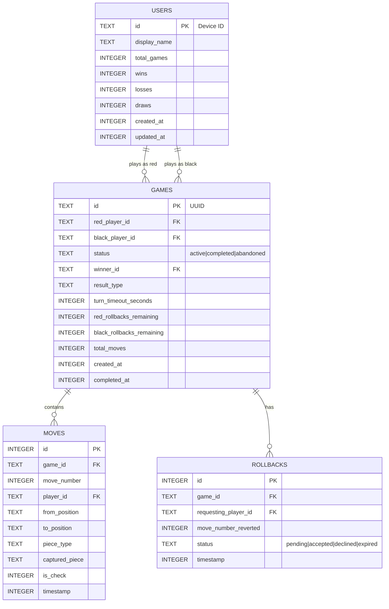

---

## API Design

### REST API Endpoints

#### Base URL
```
https://api.xiangqi-app.com/v1
```

#### Authentication Header
All requests must include:
```
X-Device-ID: {device_identifier}
X-App-Version: {app_version}
```

---

#### User Management

**POST /users/register**

Register a new device/user.

Request:
```json
{
  "device_id": "ABC123-DEF456-GHI789",
  "display_name": "Player_X7K9",
  "platform": "ios",
  "app_version": "1.0.0"
}
```

Response (201 Created):
```json
{
  "id": "ABC123-DEF456-GHI789",
  "display_name": "Player_X7K9",
  "stats": {
    "total_games": 0,
    "wins": 0,
    "losses": 0,
    "draws": 0
  },
  "created_at": "2024-01-15T10:30:00Z"
}
```

---

**GET /users/{device_id}**

Get user profile.

Response (200 OK):
```json
{
  "id": "ABC123-DEF456-GHI789",
  "display_name": "Player_X7K9",
  "stats": {
    "total_games": 42,
    "wins": 25,
    "losses": 15,
    "draws": 2
  },
  "created_at": "2024-01-15T10:30:00Z",
  "updated_at": "2024-01-20T15:45:00Z"
}
```

---

**PATCH /users/{device_id}**

Update user profile.

Request:
```json
{
  "display_name": "DragonMaster"
}
```

Response (200 OK):
```json
{
  "id": "ABC123-DEF456-GHI789",
  "display_name": "DragonMaster",
  "updated_at": "2024-01-20T16:00:00Z"
}
```

---

#### Matchmaking

**POST /matchmaking/join**

Join the matchmaking queue.

Request:
```json
{
  "settings": {
    "turn_timeout": 300,
    "preferred_color": null
  }
}
```

Response (200 OK):
```json
{
  "queue_id": "queue_789xyz",
  "position": 5,
  "estimated_wait_seconds": 30,
  "status": "waiting"
}
```

---

**DELETE /matchmaking/leave**

Leave the matchmaking queue.

Response (200 OK):
```json
{
  "status": "left"
}
```

---

**GET /matchmaking/status**

Get current queue status.

Response (200 OK):
```json
{
  "queue_id": "queue_789xyz",
  "position": 2,
  "estimated_wait_seconds": 10,
  "status": "waiting"
}
```

Or when matched:
```json
{
  "status": "matched",
  "game_id": "game_abc123",
  "opponent": {
    "id": "XYZ987",
    "display_name": "ChessMaster"
  },
  "your_color": "red",
  "websocket_url": "wss://game.xiangqi-app.com/games/game_abc123"
}
```

---

#### Match History

**GET /games/history**

Get match history with pagination.

Query Parameters:
- `page` (default: 1)
- `page_size` (default: 20, max: 50)
- `result` (optional): "win" | "loss" | "draw"
- `opponent_name` (optional): Search filter

Response (200 OK):
```json
{
  "games": [
    {
      "id": "game_abc123",
      "opponent": {
        "id": "XYZ987",
        "display_name": "ChessMaster"
      },
      "your_color": "red",
      "result": "win",
      "result_type": "checkmate",
      "total_moves": 45,
      "duration_seconds": 1234,
      "played_at": "2024-01-20T14:30:00Z"
    }
  ],
  "pagination": {
    "page": 1,
    "page_size": 20,
    "total_pages": 3,
    "total_count": 42
  }
}
```

---

**GET /games/{game_id}**

Get detailed game information.

Response (200 OK):
```json
{
  "id": "game_abc123",
  "red_player": {
    "id": "ABC123",
    "display_name": "Player_X7K9"
  },
  "black_player": {
    "id": "XYZ987",
    "display_name": "ChessMaster"
  },
  "status": "completed",
  "winner_id": "ABC123",
  "result_type": "checkmate",
  "turn_timeout": 300,
  "total_moves": 45,
  "created_at": "2024-01-20T14:00:00Z",
  "completed_at": "2024-01-20T14:20:00Z"
}
```

---

**GET /games/{game_id}/moves**

Get all moves for a game (for replay).

Response (200 OK):
```json
{
  "game_id": "game_abc123",
  "moves": [
    {
      "move_number": 1,
      "player_color": "red",
      "from": "b0",
      "to": "c2",
      "piece": "horse",
      "captured": null,
      "is_check": false,
      "notation": "N2+3",
      "timestamp": "2024-01-20T14:00:05Z"
    },
    {
      "move_number": 2,
      "player_color": "black",
      "from": "h9",
      "to": "g7",
      "piece": "horse",
      "captured": null,
      "is_check": false,
      "notation": "N8+7",
      "timestamp": "2024-01-20T14:00:15Z"
    }
  ],
  "final_state": {
    "board": "...serialized board state..."
  }
}
```

---

### WebSocket Protocol

#### Connection

```
WSS://game.xiangqi-app.com/games/{game_id}?device_id={device_id}
```

#### Message Format

All messages follow this structure:
```json
{
  "type": "message_type",
  "payload": { ... },
  "timestamp": "2024-01-20T14:00:00Z",
  "message_id": "msg_123"
}
```

#### Client to Server Messages

**Join Game**
```json
{
  "type": "join",
  "payload": {
    "device_id": "ABC123"
  }
}
```

**Make Move**
```json
{
  "type": "move",
  "payload": {
    "from": "e0",
    "to": "e1",
    "piece_type": "general"
  }
}
```

**Request Rollback**
```json
{
  "type": "rollback_request",
  "payload": {}
}
```

**Respond to Rollback**
```json
{
  "type": "rollback_response",
  "payload": {
    "accept": true
  }
}
```

**Offer Draw**
```json
{
  "type": "draw_offer",
  "payload": {}
}
```

**Respond to Draw**
```json
{
  "type": "draw_response",
  "payload": {
    "accept": false
  }
}
```

**Resign**
```json
{
  "type": "resign",
  "payload": {}
}
```

**Heartbeat**
```json
{
  "type": "ping",
  "payload": {}
}
```

---

#### Server to Client Messages

**Game State Update**
```json
{
  "type": "game_state",
  "payload": {
    "game_id": "game_abc123",
    "board": [[...]],
    "current_turn": "red",
    "red_time_remaining": 285,
    "black_time_remaining": 300,
    "red_rollbacks": 3,
    "black_rollbacks": 3,
    "is_check": false,
    "last_move": {
      "from": "e3",
      "to": "e4",
      "piece_type": "soldier"
    },
    "move_number": 15
  }
}
```

**Move Validated**
```json
{
  "type": "move_result",
  "payload": {
    "success": true,
    "move": {
      "from": "e0",
      "to": "e1",
      "piece_type": "general",
      "captured": null,
      "is_check": true
    },
    "new_state": { ... }
  }
}
```

**Move Rejected**
```json
{
  "type": "move_result",
  "payload": {
    "success": false,
    "error": "invalid_move",
    "message": "This move would leave your general in check"
  }
}
```

**Opponent Move**
```json
{
  "type": "opponent_move",
  "payload": {
    "move": {
      "from": "h9",
      "to": "g7",
      "piece_type": "horse"
    },
    "is_check": false,
    "your_time_remaining": 300
  }
}
```

**Rollback Request Received**
```json
{
  "type": "rollback_requested",
  "payload": {
    "requester": "opponent",
    "move_to_undo": 15,
    "timeout_seconds": 30
  }
}
```

**Rollback Result**
```json
{
  "type": "rollback_result",
  "payload": {
    "accepted": true,
    "new_state": { ... },
    "requester_rollbacks_remaining": 2
  }
}
```

**Timer Update**
```json
{
  "type": "timer",
  "payload": {
    "red_time": 245,
    "black_time": 289,
    "current_turn": "red"
  }
}
```

**Connection Status**
```json
{
  "type": "connection_status",
  "payload": {
    "opponent_connected": true
  }
}
```

**Game End**
```json
{
  "type": "game_end",
  "payload": {
    "winner_id": "ABC123",
    "winner_color": "red",
    "result_type": "checkmate",
    "your_result": "win",
    "final_state": { ... },
    "stats_updated": {
      "new_total": 43,
      "new_wins": 26
    }
  }
}
```

**Error**
```json
{
  "type": "error",
  "payload": {
    "code": "connection_lost",
    "message": "Opponent disconnected",
    "reconnect_timeout": 60
  }
}
```

**Heartbeat Response**
```json
{
  "type": "pong",
  "payload": {
    "server_time": "2024-01-20T14:00:00Z"
  }
}
```

---

## UI/UX Design

### Screen Flow and Navigation

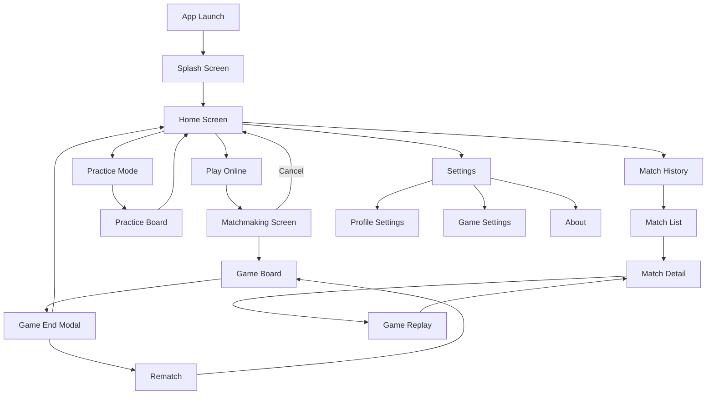

### Key Screens

#### 1. Home Screen

```
+----------------------------------+
|  [Profile Icon]     Chinese Chess|
|                                  |
|     +------------------------+   |
|     |                        |   |
|     |    [Chess Board Logo]  |   |
|     |                        |   |
|     +------------------------+   |
|                                  |
|     +------------------------+   |
|     |     PLAY ONLINE        |   |
|     +------------------------+   |
|                                  |
|     +------------------------+   |
|     |     PRACTICE MODE      |   |
|     +------------------------+   |
|                                  |
|     +------------------------+   |
|     |     MATCH HISTORY      |   |
|     +------------------------+   |
|                                  |
|     +------------------------+   |
|     |       SETTINGS         |   |
|     +------------------------+   |
|                                  |
|  Stats: 25W - 15L - 2D (62.5%)  |
+----------------------------------+
```

#### 2. Matchmaking Screen

```
+----------------------------------+
|  [Back]        Find Match        |
|                                  |
|                                  |
|        +----------------+        |
|        |                |        |
|        |  [Searching    |        |
|        |   Animation]   |        |
|        |                |        |
|        +----------------+        |
|                                  |
|        Finding opponent...       |
|        Estimated wait: 15s       |
|                                  |
|        +----------------+        |
|        |     CANCEL     |        |
|        +----------------+        |
|                                  |
|  Game Settings:                  |
|  Turn Timeout: 5 minutes         |
|                                  |
+----------------------------------+
```

#### 3. Game Board Screen

```
+----------------------------------+
|  Black: ChessMaster    [Timer]   |
|  Rollbacks: 3/3        04:32     |
+----------------------------------+
|  [Captured pieces by Red]        |
+----------------------------------+
|                                  |
|   9  车 马 象 士 将 士 象 马 车   |
|   8  .  .  .  .  .  .  .  .  .   |
|   7  .  炮  .  .  .  .  .  炮 .  |
|   6  卒 .  卒 .  卒 .  卒 .  卒   |
|   5  .  .  .  .  .  .  .  .  .   |
|      ~~~~~~~~ RIVER ~~~~~~~~     |
|   4  .  .  .  .  .  .  .  .  .   |
|   3  兵 .  兵 .  兵 .  兵 .  兵   |
|   2  .  炮  .  .  .  .  .  炮 .  |
|   1  .  .  .  .  .  .  .  .  .   |
|   0  车 马 相 仕 帅 仕 相 马 车   |
|      a  b  c  d  e  f  g  h  i   |
|                                  |
+----------------------------------+
|  [Captured pieces by Black]      |
+----------------------------------+
|  Red: You (Player_X7K9)  [Timer] |
|  Rollbacks: 3/3           05:00  |
+----------------------------------+
| [Menu]  [Rollback]  [Draw] [Resign]|
+----------------------------------+
```

#### 4. Match History Screen

```
+----------------------------------+
|  [Back]      Match History       |
+----------------------------------+
|  [All] [Wins] [Losses] [Draws]   |
|  [Search by opponent name... ]   |
+----------------------------------+
|  Overall: 42 games | 62.5% Win   |
+----------------------------------+
|                                  |
|  +----------------------------+  |
|  | vs ChessMaster        WIN  |  |
|  | Checkmate | 45 moves       |  |
|  | Jan 20, 2024 - 2:30 PM     |  |
|  +----------------------------+  |
|                                  |
|  +----------------------------+  |
|  | vs DragonKing        LOSS  |  |
|  | Timeout | 38 moves         |  |
|  | Jan 20, 2024 - 1:15 PM     |  |
|  +----------------------------+  |
|                                  |
|  +----------------------------+  |
|  | vs NewPlayer123      DRAW  |  |
|  | Agreement | 67 moves       |  |
|  | Jan 19, 2024 - 5:45 PM     |  |
|  +----------------------------+  |
|                                  |
|        [Load More...]            |
+----------------------------------+
```

#### 5. Game Replay Screen

```
+----------------------------------+
|  [Back]       Game Replay        |
|  vs ChessMaster - Jan 20, 2024   |
+----------------------------------+
|                                  |
|   [Chess Board - Current State]  |
|                                  |
|                                  |
|                                  |
|                                  |
+----------------------------------+
|  Move 23 of 45                   |
|  Red: C2+5 (Cannon to e5)        |
+----------------------------------+
|                                  |
|   [<<]  [<]  [>]  [>>]  [Play]  |
|                                  |
|  +----------------------------+  |
|  | Move List:                 |  |
|  | 1. N2+3    N8+7            |  |
|  | 2. C2+5    ...             |  |
|  +----------------------------+  |
|                                  |
+----------------------------------+
```

### SwiftUI View Hierarchy

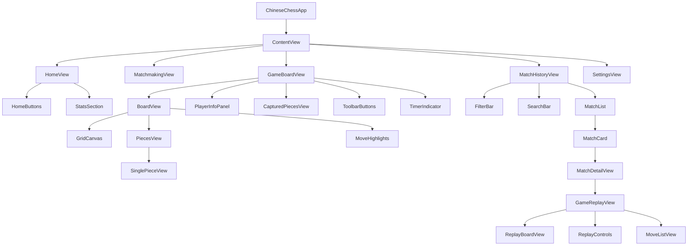

---

## Business Process

### Process 1: User Registration and Initialization

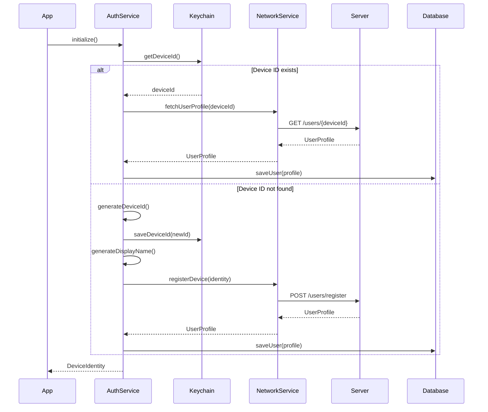

### Process 2: Matchmaking and Game Start

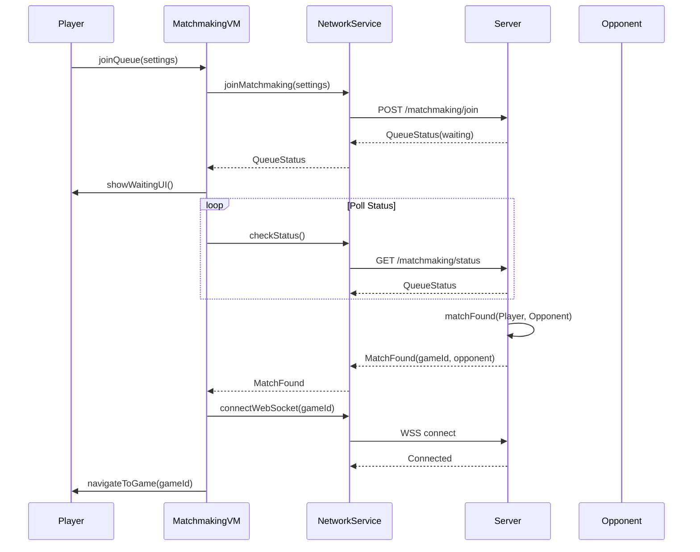

### Process 3: Making a Move

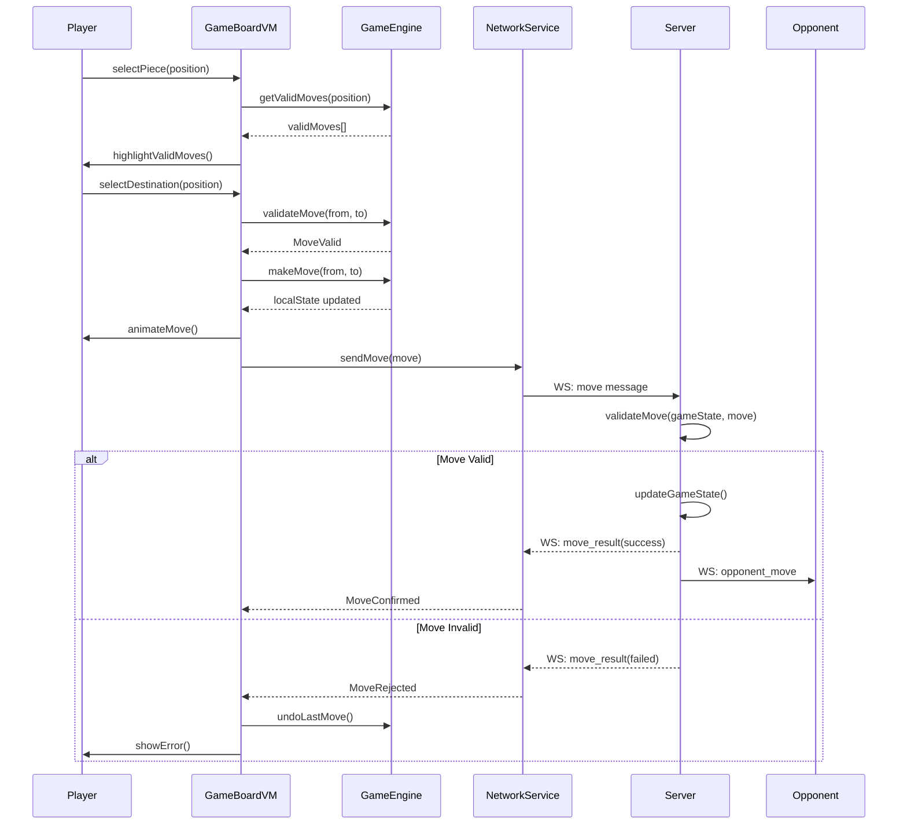

### Process 4: Rollback Request Flow

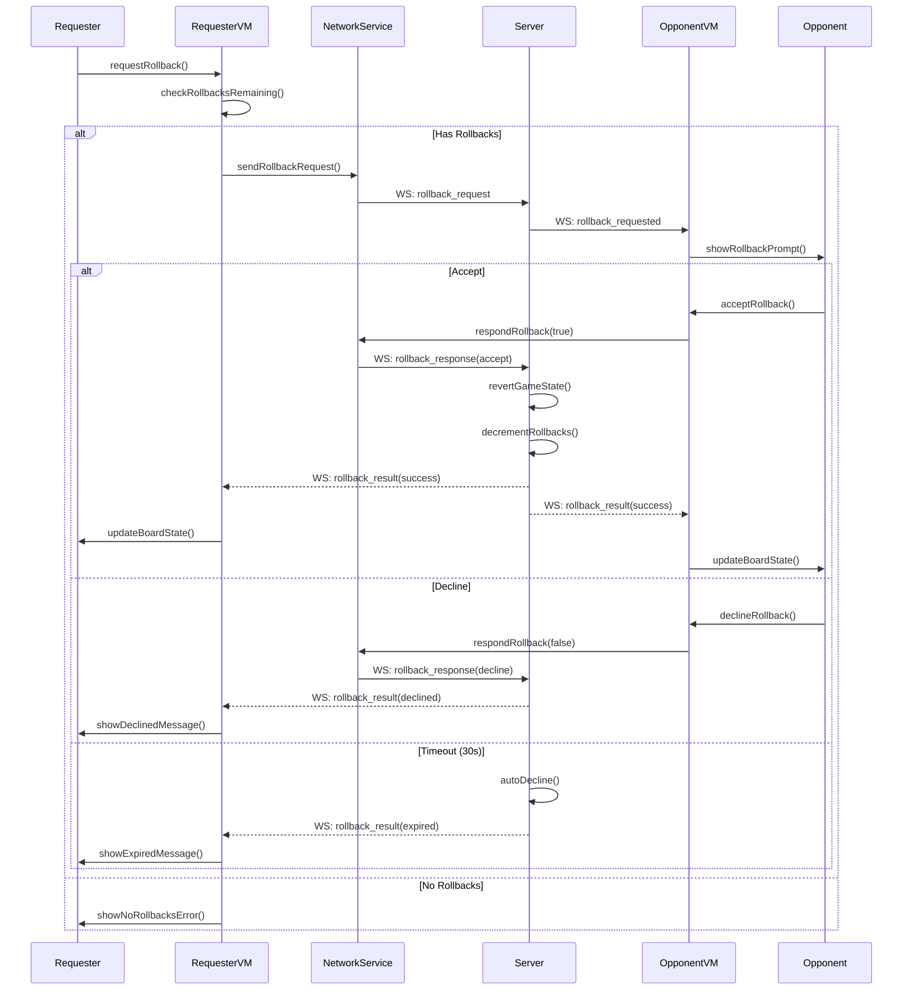

### Process 5: Turn Timeout Handling

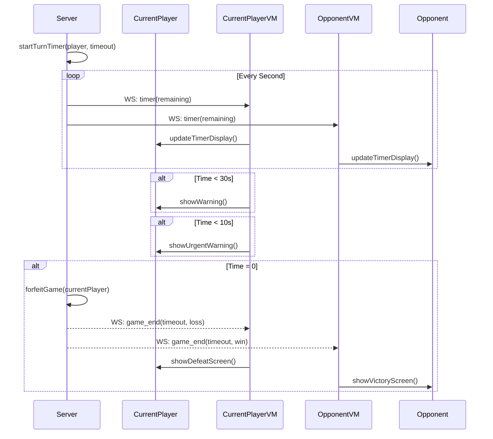

### Process 6: Disconnection and Reconnection

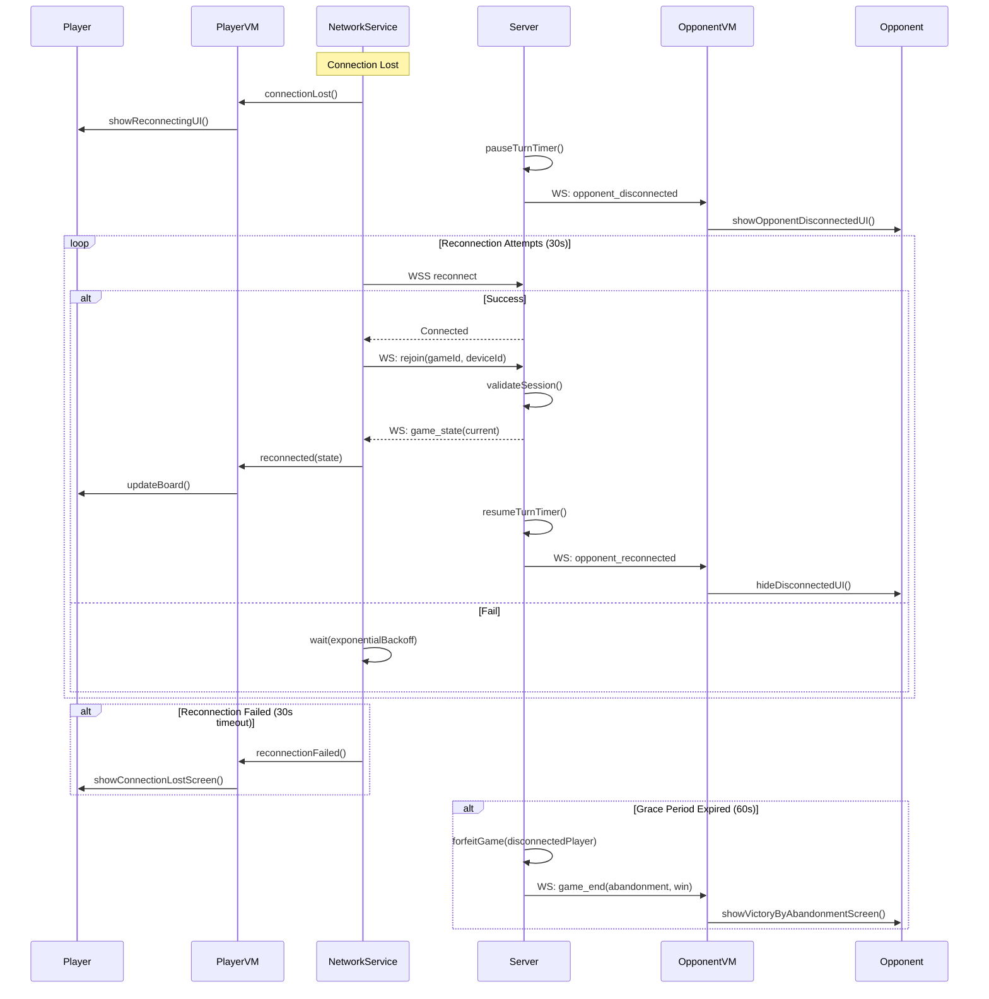

---

## Game Logic Design

### Rules Engine Architecture

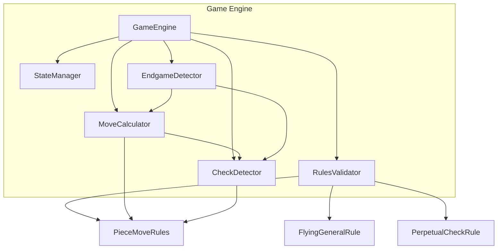

### Move Validation System

```swift
protocol MoveValidator {
    func isValidMove(piece: Piece, from: Position, to: Position, board: Board) -> Bool
    func getValidMoves(piece: Piece, board: Board) -> [Position]
}

class GeneralMoveValidator: MoveValidator {
    // Moves one step orthogonally within palace
    func isValidMove(piece: Piece, from: Position, to: Position, board: Board) -> Bool {
        guard isWithinPalace(to, color: piece.color) else { return false }
        guard isOrthogonalMove(from, to) else { return false }
        guard manhattanDistance(from, to) == 1 else { return false }
        guard !isFlyingGeneral(to, board: board, color: piece.color) else { return false }
        return true
    }
}

class AdvisorMoveValidator: MoveValidator {
    // Moves one step diagonally within palace
}

class ElephantMoveValidator: MoveValidator {
    // Moves two steps diagonally, blocked by intermediate piece, cannot cross river
}

class HorseMoveValidator: MoveValidator {
    // L-shape move, blocked by adjacent orthogonal piece
}

class ChariotMoveValidator: MoveValidator {
    // Any distance orthogonally, blocked by pieces
}

class CannonMoveValidator: MoveValidator {
    // Any distance orthogonally for non-capture
    // Must jump exactly one piece for capture
}

class SoldierMoveValidator: MoveValidator {
    // Forward only before river, forward or sideways after river
}
```

### Game State Management

```swift
class StateManager {
    private var stateHistory: [GameState] = []
    private(set) var currentState: GameState

    func pushState(_ state: GameState) {
        stateHistory.append(currentState)
        currentState = state
    }

    func popState() -> GameState? {
        guard let previous = stateHistory.popLast() else { return nil }
        currentState = previous
        return currentState
    }

    func canUndo() -> Bool {
        return !stateHistory.isEmpty
    }

    // For position repetition detection
    func getPositionCount(_ position: BoardPosition) -> Int {
        return stateHistory.filter { $0.boardPosition == position }.count
    }
}
```

### Check and Checkmate Detection

```swift
class CheckDetector {
    func isInCheck(color: PlayerColor, board: Board) -> Bool {
        guard let generalPosition = findGeneral(color: color, board: board) else {
            return false
        }

        let opponentColor = color.opposite
        let opponentPieces = board.pieces(for: opponentColor)

        for piece in opponentPieces {
            let validator = MoveValidatorFactory.validator(for: piece.type)
            if validator.canAttack(from: piece.position, to: generalPosition, board: board) {
                return true
            }
        }

        return false
    }

    func isCheckmate(color: PlayerColor, board: Board) -> Bool {
        guard isInCheck(color: color, board: board) else { return false }
        return !hasLegalMoves(color: color, board: board)
    }

    func isStalemate(color: PlayerColor, board: Board) -> Bool {
        guard !isInCheck(color: color, board: board) else { return false }
        return !hasLegalMoves(color: color, board: board)
    }

    private func hasLegalMoves(color: PlayerColor, board: Board) -> Bool {
        let pieces = board.pieces(for: color)
        for piece in pieces {
            let validator = MoveValidatorFactory.validator(for: piece.type)
            let moves = validator.getValidMoves(piece: piece, board: board)
            for move in moves {
                // Simulate move and check if still in check
                let testBoard = board.copy()
                testBoard.makeMove(from: piece.position, to: move)
                if !isInCheck(color: color, board: testBoard) {
                    return true
                }
            }
        }
        return false
    }
}
```

---

## Networking Design

### WebSocket Connection Manager

```swift
class WebSocketManager: NSObject {
    private var webSocketTask: URLSessionWebSocketTask?
    private var messageQueue: [WebSocketMessage] = []
    private var reconnectAttempts = 0
    private let maxReconnectAttempts = 10
    private var heartbeatTimer: Timer?

    @Published var connectionState: ConnectionState = .disconnected

    func connect(to url: URL) async throws {
        let session = URLSession(configuration: .default, delegate: self, delegateQueue: nil)
        webSocketTask = session.webSocketTask(with: url)
        webSocketTask?.resume()

        connectionState = .connecting
        startHeartbeat()
        receiveMessages()
    }

    func disconnect() {
        heartbeatTimer?.invalidate()
        webSocketTask?.cancel(with: .normalClosure, reason: nil)
        connectionState = .disconnected
    }

    func send(_ message: WebSocketMessage) async throws {
        guard connectionState == .connected else {
            messageQueue.append(message)
            return
        }

        let data = try JSONEncoder().encode(message)
        try await webSocketTask?.send(.data(data))
    }

    private func receiveMessages() {
        webSocketTask?.receive { [weak self] result in
            switch result {
            case .success(let message):
                self?.handleMessage(message)
                self?.receiveMessages() // Continue listening
            case .failure(let error):
                self?.handleDisconnection(error: error)
            }
        }
    }

    private func startHeartbeat() {
        heartbeatTimer = Timer.scheduledTimer(withTimeInterval: 30, repeats: true) { [weak self] _ in
            Task {
                try? await self?.send(WebSocketMessage(type: .ping, payload: [:]))
            }
        }
    }
}
```

### Reconnection Strategy

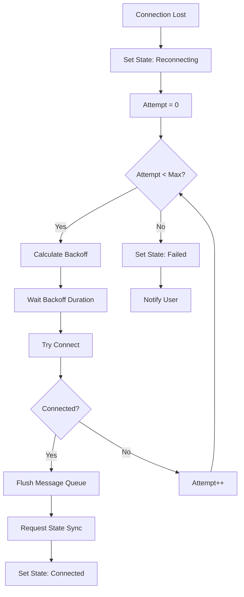

**Exponential Backoff Formula:**
```swift
func calculateBackoff(attempt: Int) -> TimeInterval {
    let baseDelay: TimeInterval = 1.0
    let maxDelay: TimeInterval = 30.0
    let delay = min(baseDelay * pow(2.0, Double(attempt)), maxDelay)
    let jitter = Double.random(in: 0...0.3) * delay
    return delay + jitter
}
```

### Message Queue for Reliability

```swift
class MessageQueue {
    private var queue: [QueuedMessage] = []
    private let maxQueueSize = 100

    struct QueuedMessage {
        let message: WebSocketMessage
        let timestamp: Date
        let retryCount: Int
    }

    func enqueue(_ message: WebSocketMessage) {
        if queue.count >= maxQueueSize {
            queue.removeFirst() // Drop oldest
        }
        queue.append(QueuedMessage(
            message: message,
            timestamp: Date(),
            retryCount: 0
        ))
    }

    func flush() async throws -> [WebSocketMessage] {
        let messages = queue.map { $0.message }
        queue.removeAll()
        return messages
    }

    func pruneExpired(maxAge: TimeInterval = 60) {
        let cutoff = Date().addingTimeInterval(-maxAge)
        queue.removeAll { $0.timestamp < cutoff }
    }
}
```

---

## Security Design

### Device ID Handling and Keychain Storage

```swift
class KeychainService {
    private let serviceIdentifier = "com.xiangqi.app"
    private let deviceIdKey = "device_identifier"

    func saveDeviceId(_ deviceId: String) throws {
        let data = deviceId.data(using: .utf8)!

        let query: [String: Any] = [
            kSecClass as String: kSecClassGenericPassword,
            kSecAttrService as String: serviceIdentifier,
            kSecAttrAccount as String: deviceIdKey,
            kSecValueData as String: data,
            kSecAttrAccessible as String: kSecAttrAccessibleAfterFirstUnlockThisDeviceOnly
        ]

        let status = SecItemAdd(query as CFDictionary, nil)

        if status == errSecDuplicateItem {
            let updateQuery: [String: Any] = [
                kSecClass as String: kSecClassGenericPassword,
                kSecAttrService as String: serviceIdentifier,
                kSecAttrAccount as String: deviceIdKey
            ]
            let updateAttributes: [String: Any] = [
                kSecValueData as String: data
            ]
            SecItemUpdate(updateQuery as CFDictionary, updateAttributes as CFDictionary)
        } else if status != errSecSuccess {
            throw KeychainError.saveFailed(status)
        }
    }

    func getDeviceId() throws -> String? {
        let query: [String: Any] = [
            kSecClass as String: kSecClassGenericPassword,
            kSecAttrService as String: serviceIdentifier,
            kSecAttrAccount as String: deviceIdKey,
            kSecReturnData as String: true,
            kSecMatchLimit as String: kSecMatchLimitOne
        ]

        var result: AnyObject?
        let status = SecItemCopyMatching(query as CFDictionary, &result)

        guard status == errSecSuccess,
              let data = result as? Data,
              let deviceId = String(data: data, encoding: .utf8) else {
            return nil
        }

        return deviceId
    }
}
```

### API Authentication

```swift
class APIAuthenticator {
    private let keychainService: KeychainService

    func authenticatedRequest(_ request: URLRequest) async throws -> URLRequest {
        var mutableRequest = request

        guard let deviceId = try keychainService.getDeviceId() else {
            throw AuthError.noDeviceId
        }

        // Add authentication headers
        mutableRequest.setValue(deviceId, forHTTPHeaderField: "X-Device-ID")
        mutableRequest.setValue(Bundle.main.appVersion, forHTTPHeaderField: "X-App-Version")
        mutableRequest.setValue(generateRequestSignature(request), forHTTPHeaderField: "X-Request-Signature")

        return mutableRequest
    }

    private func generateRequestSignature(_ request: URLRequest) -> String {
        // HMAC-SHA256 signature of request body + timestamp
        let timestamp = String(Int(Date().timeIntervalSince1970))
        let body = request.httpBody ?? Data()
        let message = timestamp + body.base64EncodedString()

        // Use a shared secret or derived key
        return HMAC<SHA256>.authenticationCode(
            for: message.data(using: .utf8)!,
            using: SymmetricKey(data: secretKey)
        ).description
    }
}
```

### Input Validation

```swift
struct InputValidator {
    static func validateDisplayName(_ name: String) -> ValidationResult {
        // Length check
        guard name.count >= 3 && name.count <= 20 else {
            return .invalid("Display name must be 3-20 characters")
        }

        // Character set check
        let allowedCharacters = CharacterSet.alphanumerics.union(CharacterSet(charactersIn: "_-"))
        guard name.unicodeScalars.allSatisfy({ allowedCharacters.contains($0) }) else {
            return .invalid("Display name can only contain letters, numbers, underscores, and hyphens")
        }

        // Profanity filter
        guard !ProfanityFilter.containsProfanity(name) else {
            return .invalid("Display name contains inappropriate content")
        }

        return .valid
    }

    static func validateMove(_ move: Move, board: Board) -> ValidationResult {
        // Position bounds check
        guard move.from.isValid && move.to.isValid else {
            return .invalid("Invalid position")
        }

        // Piece existence check
        guard let piece = board.piece(at: move.from) else {
            return .invalid("No piece at source position")
        }

        // Piece ownership check
        guard piece.color == board.currentTurn else {
            return .invalid("Not your piece")
        }

        // Move validity check
        let validator = MoveValidatorFactory.validator(for: piece.type)
        guard validator.isValidMove(piece: piece, from: move.from, to: move.to, board: board) else {
            return .invalid("Invalid move for this piece")
        }

        return .valid
    }
}
```

---

## Error Handling Strategy

### Error Types

```swift
enum AppError: LocalizedError {
    case network(NetworkError)
    case database(DatabaseError)
    case game(GameError)
    case auth(AuthError)

    var errorDescription: String? {
        switch self {
        case .network(let error): return error.localizedDescription
        case .database(let error): return error.localizedDescription
        case .game(let error): return error.localizedDescription
        case .auth(let error): return error.localizedDescription
        }
    }
}

enum NetworkError: LocalizedError {
    case noConnection
    case timeout
    case serverError(Int)
    case invalidResponse
    case websocketDisconnected

    var errorDescription: String? {
        switch self {
        case .noConnection: return "No internet connection. Please check your network."
        case .timeout: return "Request timed out. Please try again."
        case .serverError(let code): return "Server error (\(code)). Please try again later."
        case .invalidResponse: return "Invalid response from server."
        case .websocketDisconnected: return "Connection to game server lost."
        }
    }

    var isRetryable: Bool {
        switch self {
        case .noConnection, .timeout, .serverError: return true
        case .invalidResponse, .websocketDisconnected: return false
        }
    }
}

enum GameError: LocalizedError {
    case invalidMove(reason: String)
    case notYourTurn
    case gameEnded
    case opponentDisconnected
    case rollbackDenied
    case noRollbacksRemaining
}

enum AuthError: LocalizedError {
    case noDeviceId
    case keychainError
    case registrationFailed
}
```

### Error Recovery

```swift
class ErrorRecoveryService {
    func recover(from error: AppError) async -> RecoveryAction {
        switch error {
        case .network(let networkError):
            return await recoverFromNetworkError(networkError)
        case .database(let dbError):
            return await recoverFromDatabaseError(dbError)
        case .game(let gameError):
            return await recoverFromGameError(gameError)
        case .auth(let authError):
            return await recoverFromAuthError(authError)
        }
    }

    private func recoverFromNetworkError(_ error: NetworkError) async -> RecoveryAction {
        switch error {
        case .noConnection:
            // Wait for connectivity
            return .waitAndRetry(interval: 5)
        case .timeout:
            return .retryWithBackoff(maxAttempts: 3)
        case .serverError(let code) where code >= 500:
            return .retryWithBackoff(maxAttempts: 3)
        case .websocketDisconnected:
            return .reconnect
        default:
            return .showError
        }
    }

    private func recoverFromDatabaseError(_ error: DatabaseError) async -> RecoveryAction {
        switch error {
        case .corrupted:
            // Attempt to restore from server
            return .syncFromServer
        case .migrationFailed:
            return .resetDatabase
        default:
            return .showError
        }
    }
}

enum RecoveryAction {
    case retry
    case retryWithBackoff(maxAttempts: Int)
    case waitAndRetry(interval: TimeInterval)
    case reconnect
    case syncFromServer
    case resetDatabase
    case showError
    case navigateToHome
}
```

---

## Testing Strategy

### Unit Tests

| Component | Test Coverage |
|-----------|---------------|
| GameEngine | Move validation for all 7 piece types |
| RulesValidator | Check/checkmate/stalemate detection |
| StateManager | State push/pop, history tracking |
| InputValidator | Display name validation, move validation |
| KeychainService | Save/retrieve/delete operations |
| MessageQueue | Enqueue/dequeue, expiration pruning |

### Integration Tests

| Test Scenario | Components Involved |
|---------------|---------------------|
| User Registration | AuthService + NetworkService + Database |
| Game Creation | MatchmakingService + WebSocket + GameEngine |
| Move Synchronization | GameEngine + WebSocket + Server |
| Rollback Flow | GameEngine + StateManager + WebSocket |
| Disconnection Recovery | WebSocket + NetworkService + StateManager |

### UI Tests

| Screen | Test Cases |
|--------|------------|
| Home | Navigation to all screens, stats display |
| Matchmaking | Join queue, cancel queue, match found |
| Game Board | Piece selection, move execution, timer display |
| Match History | List display, filtering, search, pagination |
| Game Replay | Playback controls, move navigation |

### Performance Tests

| Metric | Target | Test Method |
|--------|--------|-------------|
| App Launch | < 3 seconds | Measure from main() to UI ready |
| Move Calculation | < 50ms | Profile getValidMoves() |
| Board Render | 60 fps | Instruments GPU profiler |
| Database Query | < 100ms | Measure single-record operations |
| WebSocket Latency | < 500ms | Round-trip time measurement |

---

## Technology Stack

### iOS Client

| Category | Technology | Purpose |
|----------|------------|---------|
| Language | Swift 5.9+ | Primary development language |
| UI Framework | SwiftUI | Declarative UI |
| Reactive | Combine | State management, async streams |
| Networking | URLSession | REST API calls |
| WebSocket | URLSessionWebSocketTask | Real-time communication |
| Database | GRDB.swift | SQLite wrapper |
| Keychain | Security.framework | Secure storage |
| Audio | AVFoundation | Sound effects |
| Haptics | UIKit | Haptic feedback |

### Backend (Recommended)

| Category | Technology | Purpose |
|----------|------------|---------|
| Runtime | Node.js / Go | Server application |
| Framework | Express / Fiber | REST API |
| WebSocket | ws / gorilla/websocket | Real-time communication |
| Database | PostgreSQL | Persistent storage |
| Cache | Redis | Matchmaking queue, session cache |
| Authentication | JWT (optional) | Request signing |

### Development Tools

| Tool | Purpose |
|------|---------|
| Xcode 15+ | IDE and build system |
| Swift Package Manager | Dependency management |
| XCTest | Unit and UI testing |
| Instruments | Performance profiling |
| TestFlight | Beta distribution |

---

## Appendix

### Board Coordinate System

```
    a   b   c   d   e   f   g   h   i
  +---+---+---+---+---+---+---+---+---+
9 |   |   |   | X | X | X |   |   |   |  <- Black Palace
  +---+---+---+---+---+---+---+---+---+
8 |   |   |   | X | X | X |   |   |   |
  +---+---+---+---+---+---+---+---+---+
7 |   |   |   | X | X | X |   |   |   |
  +---+---+---+---+---+---+---+---+---+
6 |   |   |   |   |   |   |   |   |   |
  +---+---+---+---+---+---+---+---+---+
5 |   |   |   |   |   |   |   |   |   |
  =========== RIVER ===========
4 |   |   |   |   |   |   |   |   |   |
  +---+---+---+---+---+---+---+---+---+
3 |   |   |   |   |   |   |   |   |   |
  +---+---+---+---+---+---+---+---+---+
2 |   |   |   | X | X | X |   |   |   |
  +---+---+---+---+---+---+---+---+---+
1 |   |   |   | X | X | X |   |   |   |
  +---+---+---+---+---+---+---+---+---+
0 |   |   |   | X | X | X |   |   |   |  <- Red Palace
  +---+---+---+---+---+---+---+---+---+
    0   1   2   3   4   5   6   7   8
```

### Initial Piece Positions

**Red Side (Bottom):**
- Chariots: a0, i0
- Horses: b0, h0
- Elephants: c0, g0
- Advisors: d0, f0
- General: e0
- Cannons: b2, h2
- Soldiers: a3, c3, e3, g3, i3

**Black Side (Top):**
- Chariots: a9, i9
- Horses: b9, h9
- Elephants: c9, g9
- Advisors: d9, f9
- General: e9
- Cannons: b7, h7
- Soldiers: a6, c6, e6, g6, i6

---

## References

- [Xiangqi Rules - World Xiangqi Federation](https://www.wxf-xiangqi.org/)
- [Apple Human Interface Guidelines](https://developer.apple.com/design/human-interface-guidelines/)
- [Swift API Design Guidelines](https://swift.org/documentation/api-design-guidelines/)
- [GRDB.swift Documentation](https://github.com/groue/GRDB.swift)
- [WebSocket RFC 6455](https://tools.ietf.org/html/rfc6455)
