# Chinese Chess (Xiangqi) iPhone Application - Implementation Plan

## Overview

This document provides a comprehensive task breakdown for implementing the Chinese Chess (Xiangqi) iPhone application with a Go backend. Tasks are organized by component and include dependencies, acceptance criteria, and priority levels.

---

## Task Categories

| Category | Prefix | Description |
|----------|--------|-------------|
| Project Setup | SETUP | Initial project configuration and environment |
| Backend | BE | Go backend server development |
| iOS Client | iOS | iPhone application development |
| Integration | INT | Client-server integration and testing |
| Deployment | DEP | Build, deployment, and distribution |

---

## 1. Project Setup Tasks

- [x] 1.1 Set up iOS project structure
  - Create new Xcode project with SwiftUI App template
  - Configure project for iOS 15.0+ deployment target
  - Set up folder structure: Views, ViewModels, Models, Services, Core, Utilities
  - Configure Swift Package Manager dependencies (GRDB.swift)
  - Set up build configurations (Debug, Release)
  - Create Info.plist with required privacy descriptions
  - **Task ID:** SETUP-001
  - **Dependencies:** None
  - **Priority:** High
  - **Acceptance Criteria:**
    - Project builds successfully in Xcode
    - Folder structure follows MVVM pattern
    - GRDB.swift package resolves correctly
  - _Requirements: 10.1, 10.2, 10.3, 10.4_

- [x] 1.2 Set up Go backend project structure
  - Initialize Go module with `go mod init`
  - Create project structure: cmd/, internal/, pkg/, api/, configs/
  - Set up internal packages: handlers/, services/, models/, repository/, middleware/
  - Configure environment variables and configuration loading (Viper)
  - Set up logging framework (zerolog or zap)
  - Create Makefile for common build tasks
  - **Task ID:** SETUP-002
  - **Dependencies:** None
  - **Priority:** High
  - **Acceptance Criteria:**
    - Go project compiles with `go build`
    - Configuration loads from environment/files
    - Logging outputs structured logs
  - _Requirements: 9.1, 9.2_

- [x] 1.3 Configure development environment and tooling
  - Set up Docker Compose for local development (PostgreSQL, Redis)
  - Create database initialization scripts
  - Configure hot-reload for Go development (air)
  - Set up code formatting and linting (golangci-lint, swiftlint)
  - Create README with setup instructions
  - **Task ID:** SETUP-003
  - **Dependencies:** SETUP-002
  - **Priority:** High
  - **Acceptance Criteria:**
    - `docker-compose up` starts PostgreSQL and Redis
    - Hot-reload works for Go backend
    - Linting runs without errors on clean code
  - _Requirements: 9.1, 9.6_

---

## 2. Backend Tasks (Go)

### 2.1 Database Layer

- [x] 2.1.1 Create PostgreSQL database schema and migrations
  - Design and create `users` table with columns: id, device_id, display_name, total_games, wins, losses, draws, created_at, updated_at
  - Design and create `games` table with columns: id, red_player_id, black_player_id, status, winner_id, result_type, turn_timeout_seconds, red_rollbacks_remaining, black_rollbacks_remaining, total_moves, created_at, completed_at
  - Design and create `moves` table with columns: id, game_id, move_number, player_id, from_position, to_position, piece_type, captured_piece, is_check, timestamp
  - Design and create `rollbacks` table with columns: id, game_id, requesting_player_id, move_number_reverted, status, timestamp
  - Set up migration tool (golang-migrate or goose)
  - Create indexes for frequently queried columns
  - **Task ID:** BE-001
  - **Dependencies:** SETUP-003
  - **Priority:** High
  - **Acceptance Criteria:**
    - All migrations run successfully
    - Foreign key constraints are properly defined
    - Indexes exist for device_id, game_id lookups
  - _Requirements: 8.1, 8.2, 8.3, 8.4, 8.5, 8.6, 8.7, 8.8, 8.9_

- [ ] 2.1.2 Implement database repository layer
  - Create `UserRepository` interface and implementation with CRUD operations
  - Create `GameRepository` interface and implementation with game lifecycle methods
  - Create `MoveRepository` interface and implementation for move persistence
  - Create `RollbackRepository` interface and implementation
  - Implement connection pooling configuration
  - Add transaction support for atomic operations
  - Write unit tests for repository methods using test database
  - **Task ID:** BE-002
  - **Dependencies:** BE-001
  - **Priority:** High
  - **Acceptance Criteria:**
    - All CRUD operations work correctly
    - Transactions commit/rollback properly
    - Unit tests pass with >80% coverage
  - _Requirements: 8.9, 8.10, 8.12_

### 2.2 Redis Integration

- [ ] 2.2.1 Implement Redis client and matchmaking queue
  - Configure Redis client with connection pooling
  - Implement matchmaking queue using Redis sorted sets
  - Create queue operations: add player, remove player, find match
  - Implement estimated wait time calculation
  - Add queue position tracking
  - Write unit tests for queue operations
  - **Task ID:** BE-003
  - **Dependencies:** SETUP-003
  - **Priority:** High
  - **Acceptance Criteria:**
    - Players can be added/removed from queue
    - Matching algorithm finds suitable opponents
    - Wait time estimation is reasonably accurate
  - _Requirements: 2.1, 2.2, 2.3_

- [ ] 2.2.2 Implement session and game state caching
  - Design cache keys for active game sessions
  - Implement game state caching for fast access
  - Add TTL-based expiration for inactive sessions
  - Create cache invalidation strategies
  - Implement distributed locking for concurrent game updates
  - Write tests for cache operations
  - **Task ID:** BE-004
  - **Dependencies:** BE-003
  - **Priority:** Medium
  - **Acceptance Criteria:**
    - Game state retrieval is under 10ms
    - Cache invalidation works correctly
    - Distributed locks prevent race conditions
  - _Requirements: 9.4, 9.5_

### 2.3 User Management API

- [ ] 2.3.1 Implement user registration endpoint
  - Create `POST /api/v1/users/register` endpoint
  - Validate device_id format and display_name
  - Generate default display name if not provided
  - Store user in PostgreSQL database
  - Return user profile with stats
  - Add rate limiting middleware
  - Write API tests
  - **Task ID:** BE-005
  - **Dependencies:** BE-002
  - **Priority:** High
  - **Acceptance Criteria:**
    - New users are created successfully
    - Duplicate device_id returns existing user
    - Invalid input returns appropriate errors
  - _Requirements: 1.1, 1.4, 1.8_

- [ ] 2.3.2 Implement user profile endpoints
  - Create `GET /api/v1/users/{device_id}` endpoint
  - Create `PATCH /api/v1/users/{device_id}` endpoint for display name update
  - Implement display name validation (3-20 chars, alphanumeric)
  - Add basic profanity filter for display names
  - Return updated profile with stats
  - Write API tests
  - **Task ID:** BE-006
  - **Dependencies:** BE-005
  - **Priority:** High
  - **Acceptance Criteria:**
    - User profiles are retrievable by device_id
    - Display name updates persist correctly
    - Invalid names are rejected with clear errors
  - _Requirements: 1.5, 1.6_

### 2.4 Matchmaking System

- [ ] 2.4.1 Implement matchmaking API endpoints
  - Create `POST /api/v1/matchmaking/join` endpoint
  - Create `DELETE /api/v1/matchmaking/leave` endpoint
  - Create `GET /api/v1/matchmaking/status` endpoint
  - Accept game settings (turn_timeout) in join request
  - Return queue status with position and estimated wait
  - Write API tests
  - **Task ID:** BE-007
  - **Dependencies:** BE-003, BE-005
  - **Priority:** High
  - **Acceptance Criteria:**
    - Players can join and leave queue
    - Status endpoint returns current position
    - Settings are validated properly
  - _Requirements: 2.1, 2.2_

- [ ] 2.4.2 Implement matchmaking service logic
  - Create background goroutine for matching players
  - Implement matching algorithm based on queue order
  - Create game record when match is found
  - Assign colors randomly to players
  - Notify matched players via callback/channel
  - Add timeout for players in queue too long
  - Write unit tests for matching logic
  - **Task ID:** BE-008
  - **Dependencies:** BE-007
  - **Priority:** High
  - **Acceptance Criteria:**
    - Players are matched within expected time
    - Colors are assigned randomly
    - Game record is created on match
  - _Requirements: 2.3, 5.2_

### 2.5 WebSocket Server

- [ ] 2.5.1 Set up WebSocket server infrastructure
  - Configure gorilla/websocket for WebSocket handling
  - Create connection manager for tracking active connections
  - Implement connection upgrade handler at `/ws/games/{game_id}`
  - Add device_id authentication on connection
  - Implement heartbeat/ping-pong mechanism
  - Handle graceful disconnection
  - **Task ID:** BE-009
  - **Dependencies:** SETUP-002
  - **Priority:** High
  - **Acceptance Criteria:**
    - WebSocket connections establish successfully
    - Heartbeat keeps connections alive
    - Disconnections are detected within 30 seconds
  - _Requirements: 2.4, 9.1_

- [ ] 2.5.2 Implement WebSocket message handlers
  - Define message types: join, move, rollback_request, rollback_response, draw_offer, draw_response, resign, ping
  - Create message router for incoming messages
  - Implement JSON serialization/deserialization
  - Add message validation and error responses
  - Create broadcast mechanism for game events
  - Write unit tests for message handling
  - **Task ID:** BE-010
  - **Dependencies:** BE-009
  - **Priority:** High
  - **Acceptance Criteria:**
    - All message types are handled correctly
    - Invalid messages return errors
    - Messages broadcast to both players
  - _Requirements: 2.5, 2.10_

- [x] 2.5.3 Implement game room management
  - Create game room struct to hold player connections
  - Implement player join/leave room logic
  - Handle reconnection to existing game
  - Manage room lifecycle (create, active, completed)
  - Implement spectator support (optional)
  - Add room cleanup after game ends
  - **Task ID:** BE-011
  - **Dependencies:** BE-010
  - **Priority:** High
  - **Acceptance Criteria:**
    - Two players can join the same game room
    - Reconnection restores game state
    - Rooms are cleaned up after game ends
  - _Requirements: 2.4, 2.6, 2.8_

### 2.6 Game State Management

- [x] 2.6.1 Implement game state data structures
  - Create Board struct (10x9 grid)
  - Create Piece struct with type and color
  - Create Position struct with file and rank
  - Create GameState struct with board, turn, captured pieces
  - Implement state serialization for storage and transmission
  - Write unit tests for data structures
  - **Task ID:** BE-012
  - **Dependencies:** SETUP-002
  - **Priority:** High
  - **Acceptance Criteria:**
    - Board correctly represents 10x9 grid
    - Pieces are positioned correctly
    - State serializes/deserializes without loss
  - _Requirements: 3.1, 3.2_

- [x] 2.6.2 Implement game initialization and state transitions
  - Create initial board setup with all 32 pieces
  - Implement turn switching logic
  - Track captured pieces for both players
  - Implement move history tracking
  - Create state snapshot for rollback support
  - Write unit tests for state transitions
  - **Task ID:** BE-013
  - **Dependencies:** BE-012
  - **Priority:** High
  - **Acceptance Criteria:**
    - Initial position matches standard Xiangqi setup
    - Turns alternate correctly
    - Move history is accurate
  - _Requirements: 3.2, 6.8_

### 2.7 Move Validation

- [x] 2.7.1 Implement piece movement rules
  - Implement General movement (one step orthogonally in palace)
  - Implement Advisor movement (one step diagonally in palace)
  - Implement Elephant movement (two steps diagonally, blocking, no river crossing)
  - Implement Horse movement (L-shape with blocking)
  - Implement Chariot movement (any orthogonal distance)
  - Implement Cannon movement (orthogonal, jump capture)
  - Implement Soldier movement (forward, sideways after river)
  - Write comprehensive unit tests for each piece type
  - **Task ID:** BE-014
  - **Dependencies:** BE-012
  - **Priority:** High
  - **Acceptance Criteria:**
    - All piece movements match Xiangqi rules
    - Blocking rules are enforced correctly
    - Edge cases are handled (palace bounds, river)
  - _Requirements: 3.4, 3.5, 3.6, 3.7, 3.8, 3.9, 3.10, 3.11_

- [x] 2.7.2 Implement special rules validation
  - Implement Flying General rule (generals cannot face each other)
  - Implement check detection
  - Implement checkmate detection
  - Implement stalemate detection (loss in Xiangqi)
  - Implement perpetual check/chase detection
  - Implement position repetition tracking
  - Write unit tests for special rules
  - **Task ID:** BE-015
  - **Dependencies:** BE-014
  - **Priority:** High
  - **Acceptance Criteria:**
    - Flying General rule prevents illegal moves
    - Check is detected immediately
    - Checkmate ends game correctly
    - Perpetual check is detected after threshold
  - _Requirements: 3.12, 3.13, 3.14, 3.15, 3.16, 3.17_

- [x] 2.7.3 Implement move validation service
  - Create MoveValidator service combining all rules
  - Validate move source has correct player's piece
  - Validate move doesn't leave own general in check
  - Return detailed validation errors
  - Cache valid moves for performance
  - Write integration tests for validation
  - **Task ID:** BE-016
  - **Dependencies:** BE-015
  - **Priority:** High
  - **Acceptance Criteria:**
    - Only valid moves are accepted
    - Invalid moves return specific error reasons
    - Validation completes under 50ms
  - _Requirements: 2.10, 3.13, 9.3, 9.5_

### 2.8 Turn Timer System

- [x] 2.8.1 Implement server-side turn timer
  - Create timer manager for active games
  - Implement countdown with configurable timeout
  - Send timer updates to clients every second
  - Handle timer pause during disconnection
  - Implement timeout forfeit logic
  - Write unit tests for timer behavior
  - **Task ID:** BE-017
  - **Dependencies:** BE-011
  - **Priority:** High
  - **Acceptance Criteria:**
    - Timer counts down accurately
    - Timer pauses on disconnect
    - Timeout triggers game forfeit
  - _Requirements: 5.1, 5.3, 5.4, 5.7, 5.9, 5.10_

- [x] 2.8.2 Implement timer synchronization
  - Send authoritative time to clients periodically
  - Handle timer discrepancies between clients
  - Compensate for network latency
  - Resume timer with correct value on reconnection
  - Write integration tests for sync
  - **Task ID:** BE-018
  - **Dependencies:** BE-017
  - **Priority:** Medium
  - **Acceptance Criteria:**
    - Client timers stay within 1 second of server
    - Reconnected clients receive correct time
    - Latency doesn't cause unfair timeouts
  - _Requirements: 5.8, 5.9, 5.10_

### 2.9 Rollback System

- [x] 2.9.1 Implement rollback request handling
  - Create rollback request handler
  - Validate requester has remaining rollbacks
  - Send rollback request to opponent
  - Implement 30-second response timeout
  - Track rollback history in database
  - Write unit tests for rollback flow
  - **Task ID:** BE-019
  - **Dependencies:** BE-011, BE-013
  - **Priority:** Medium
  - **Acceptance Criteria:**
    - Rollback requests reach opponent
    - No-response triggers auto-decline
    - Rollback count decrements on acceptance
  - _Requirements: 6.1, 6.2, 6.3, 6.7_

- [x] 2.9.2 Implement rollback execution
  - Implement game state reversion
  - Restore previous board position
  - Restore previous turn
  - Update rollback count in game record
  - Broadcast new state to both players
  - Write integration tests
  - **Task ID:** BE-020
  - **Dependencies:** BE-019
  - **Priority:** Medium
  - **Acceptance Criteria:**
    - Board reverts to previous state correctly
    - Both players see same reverted state
    - Rollback count updates in database
  - _Requirements: 6.5, 6.8, 6.11_

### 2.10 Match History API

- [x] 2.10.1 Implement match history endpoints
  - Create `GET /api/v1/games/history` with pagination
  - Support filtering by result (win/loss/draw)
  - Support searching by opponent name
  - Return game summary with opponent, result, moves, duration
  - Implement efficient pagination with cursor or offset
  - Write API tests
  - **Task ID:** BE-021
  - **Dependencies:** BE-002
  - **Priority:** Medium
  - **Acceptance Criteria:**
    - History returns games sorted by date descending
    - Pagination works correctly
    - Filters narrow results appropriately
  - _Requirements: 7.1, 7.2, 7.7, 7.11, 7.12_

- [x] 2.10.2 Implement game detail and replay endpoints
  - Create `GET /api/v1/games/{game_id}` for game details
  - Create `GET /api/v1/games/{game_id}/moves` for move list
  - Return complete move history with notation
  - Include final board state
  - Write API tests
  - **Task ID:** BE-022
  - **Dependencies:** BE-021
  - **Priority:** Medium
  - **Acceptance Criteria:**
    - Game details include all metadata
    - Moves are in correct order with notation
    - Final state can reconstruct board
  - _Requirements: 7.3, 7.4, 7.5_

### 2.11 Security and Middleware

- [ ] 2.11.1 Implement authentication middleware
  - Create middleware to validate X-Device-ID header
  - Validate device ID format
  - Reject requests without valid device ID
  - Add request logging with device ID
  - Write middleware tests
  - **Task ID:** BE-023
  - **Dependencies:** SETUP-002
  - **Priority:** High
  - **Acceptance Criteria:**
    - Requests without device ID are rejected
    - Invalid device IDs are rejected
    - Valid requests proceed to handlers
  - _Requirements: 9.11, 9.12_

- [ ] 2.11.2 Implement rate limiting and security
  - Add rate limiting (100 requests/minute per device)
  - Implement input sanitization
  - Add SQL injection protection (parameterized queries)
  - Configure CORS for iOS app
  - Add HTTPS enforcement
  - Write security tests
  - **Task ID:** BE-024
  - **Dependencies:** BE-023
  - **Priority:** High
  - **Acceptance Criteria:**
    - Rate limit triggers after threshold
    - Malicious input is sanitized
    - HTTPS is required for all endpoints
  - _Requirements: 9.11, 9.13, 9.14_

---

## 3. iOS Client Tasks

### 3.1 Core Infrastructure

- [x] 3.1.1 Implement Keychain service for device identity
  - Create KeychainService class using Security framework
  - Implement secure storage of device identifier
  - Implement retrieval of stored device ID
  - Handle Keychain access errors gracefully
  - Add accessibility configuration for background access
  - Write unit tests with mock Keychain
  - **Task ID:** iOS-001
  - **Dependencies:** SETUP-001
  - **Priority:** High
  - **Acceptance Criteria:**
    - Device ID persists across app launches
    - Device ID survives app reinstall (if Keychain persists)
    - Errors are handled gracefully
  - _Requirements: 1.1, 1.2, 1.3_

- [ ] 3.1.2 Implement AuthService for user identification
  - Create AuthServiceProtocol with initialize(), updateDisplayName()
  - Implement IDFV-based device ID generation
  - Generate random default display names (Player_XXXX)
  - Implement display name validation
  - Coordinate with NetworkService for registration
  - Write unit tests
  - **Task ID:** iOS-002
  - **Dependencies:** iOS-001
  - **Priority:** High
  - **Acceptance Criteria:**
    - First launch generates and stores device ID
    - Subsequent launches retrieve existing ID
    - Display names validate correctly
  - _Requirements: 1.1, 1.4, 1.5, 1.6_

### 3.2 Local Database

- [ ] 3.2.1 Set up SQLite database with GRDB.swift
  - Configure GRDB.swift database connection
  - Create database file in app's documents directory
  - Implement database migration system
  - Create User record type conforming to GRDB protocols
  - Create Game record type
  - Create Move record type
  - Write database initialization tests
  - **Task ID:** iOS-003
  - **Dependencies:** SETUP-001
  - **Priority:** High
  - **Acceptance Criteria:**
    - Database creates on first launch
    - Migrations run automatically
    - Record types map to tables correctly
  - _Requirements: 8.1, 8.3, 8.5, 8.10_

- [ ] 3.2.2 Implement DatabaseService
  - Create DatabaseServiceProtocol with all CRUD methods
  - Implement user save/fetch operations
  - Implement game history save/fetch with pagination
  - Implement move save/fetch for replay
  - Implement statistics update methods
  - Add error handling and transactions
  - Write unit tests
  - **Task ID:** iOS-004
  - **Dependencies:** iOS-003
  - **Priority:** High
  - **Acceptance Criteria:**
    - All CRUD operations work correctly
    - Pagination returns correct results
    - Errors are propagated properly
  - _Requirements: 7.9, 7.10, 8.12, Non-Functional 4_

### 3.3 Network Layer

- [ ] 3.3.1 Implement REST API client
  - Create APIClient class using URLSession
  - Define API endpoint URLs and constants
  - Implement request building with headers (X-Device-ID, X-App-Version)
  - Implement JSON encoding/decoding
  - Add retry logic with exponential backoff
  - Handle common HTTP errors
  - Write unit tests with mock responses
  - **Task ID:** iOS-005
  - **Dependencies:** iOS-002
  - **Priority:** High
  - **Acceptance Criteria:**
    - API calls include required headers
    - JSON responses decode to models
    - Network errors trigger retries
  - _Requirements: 9.8, Non-Functional 5_

- [ ] 3.3.2 Implement NetworkService for REST operations
  - Create NetworkServiceProtocol
  - Implement registerDevice() method
  - Implement fetchUserProfile() method
  - Implement updateDisplayName() method
  - Implement fetchMatchHistory() with pagination
  - Implement fetchGameMoves() for replay
  - Write integration tests
  - **Task ID:** iOS-006
  - **Dependencies:** iOS-005
  - **Priority:** High
  - **Acceptance Criteria:**
    - All REST endpoints are callable
    - Responses map to Swift models
    - Errors are typed and informative
  - _Requirements: 9.2, 9.8, 9.9_

- [x] 3.3.3 Implement WebSocket manager
  - Create WebSocketManager class using URLSessionWebSocketTask
  - Implement connection establishment with game_id
  - Implement message sending with JSON encoding
  - Implement message receiving with event publishing
  - Add automatic reconnection with backoff
  - Implement heartbeat ping/pong
  - Create message queue for offline messages
  - Write unit tests
  - **Task ID:** iOS-007
  - **Dependencies:** SETUP-001
  - **Priority:** High
  - **Acceptance Criteria:**
    - WebSocket connects successfully
    - Messages send and receive correctly
    - Reconnection attempts on disconnect
  - _Requirements: 2.4, 2.6, Non-Functional 5_

### 3.4 Game Engine

- [x] 3.4.1 Implement data models
  - Create Position struct with file and rank
  - Create PieceType enum (general, advisor, elephant, horse, chariot, cannon, soldier)
  - Create PlayerColor enum (red, black)
  - Create Piece struct with type, color, position
  - Create Move struct with from, to, piece, captured
  - Create GameState struct with board, turn, history
  - Write unit tests for model operations
  - **Task ID:** iOS-008
  - **Dependencies:** SETUP-001
  - **Priority:** High
  - **Acceptance Criteria:**
    - All models are Codable
    - Position provides notation string
    - Piece provides Chinese character
  - _Requirements: 3.1, 3.2_

- [x] 3.4.2 Implement board representation
  - Create Board class with 10x9 grid
  - Implement piece placement and retrieval
  - Implement piece movement on board
  - Implement initial position setup
  - Create board copy for simulation
  - Write unit tests
  - **Task ID:** iOS-009
  - **Dependencies:** iOS-008
  - **Priority:** High
  - **Acceptance Criteria:**
    - Board correctly stores pieces
    - Initial setup matches standard position
    - Board copies are independent
  - _Requirements: 3.1, 3.2_

- [x] 3.4.3 Implement piece movement validators
  - Create MoveValidator protocol
  - Implement GeneralMoveValidator (palace, orthogonal)
  - Implement AdvisorMoveValidator (palace, diagonal)
  - Implement ElephantMoveValidator (diagonal, blocking, no river)
  - Implement HorseMoveValidator (L-shape, blocking)
  - Implement ChariotMoveValidator (orthogonal lines)
  - Implement CannonMoveValidator (jump capture)
  - Implement SoldierMoveValidator (forward, sideways after river)
  - Write comprehensive unit tests for each validator
  - **Task ID:** iOS-010
  - **Dependencies:** iOS-009
  - **Priority:** High
  - **Acceptance Criteria:**
    - Each piece type validates correctly
    - Blocking rules enforced
    - Edge cases handled (palace, river)
  - _Requirements: 3.4, 3.5, 3.6, 3.7, 3.8, 3.9, 3.10, 3.11_

- [x] 3.4.4 Implement special rules
  - Implement Flying General rule validation
  - Implement check detection
  - Implement legal move filtering (must escape check)
  - Implement checkmate detection
  - Implement stalemate detection
  - Write unit tests for special scenarios
  - **Task ID:** iOS-011
  - **Dependencies:** iOS-010
  - **Priority:** High
  - **Acceptance Criteria:**
    - Flying General moves are prevented
    - Check status is detected
    - Checkmate/stalemate end game
  - _Requirements: 3.12, 3.13, 3.14, 3.15_

- [x] 3.4.5 Implement GameEngine
  - Create GameEngineProtocol
  - Implement getValidMoves(for position)
  - Implement makeMove(from, to) with validation
  - Implement undoLastMove() for rollback
  - Implement loadState() for reconnection
  - Implement resetGame()
  - Track move history for replay
  - Write integration tests
  - **Task ID:** iOS-012
  - **Dependencies:** iOS-011
  - **Priority:** High
  - **Acceptance Criteria:**
    - Valid moves are calculated correctly
    - Moves execute and update state
    - Undo restores previous state
  - _Requirements: 3.13, 6.8_

### 3.5 UI Screens

- [ ] 3.5.1 Implement HomeView
  - Create main menu with app logo/title
  - Add "Play Online" button
  - Add "Practice Mode" button (optional placeholder)
  - Add "Match History" button
  - Add "Settings" button
  - Display user stats summary (wins/losses/draws)
  - Create HomeViewModel with navigation state
  - Write UI tests
  - **Task ID:** iOS-013
  - **Dependencies:** iOS-002, iOS-004
  - **Priority:** High
  - **Acceptance Criteria:**
    - All buttons navigate correctly
    - Stats display current values
    - Layout looks good on all iPhone sizes
  - _Requirements: 4.1_

- [x] 3.5.2 Implement MatchmakingView
  - Create searching animation
  - Display "Finding opponent..." text
  - Display estimated wait time
  - Add Cancel button to leave queue
  - Show game settings (turn timeout)
  - Create MatchmakingViewModel with queue state
  - Handle match found event and navigate to game
  - Write UI tests
  - **Task ID:** iOS-014
  - **Dependencies:** iOS-006, iOS-007
  - **Priority:** High
  - **Acceptance Criteria:**
    - Animation shows while searching
    - Wait time updates periodically
    - Cancel returns to home
    - Match navigates to game
  - _Requirements: 2.1, 2.2, 2.3_

- [x] 3.5.3 Implement BoardView
  - Create 10x9 grid with correct proportions
  - Draw traditional board lines and markings
  - Draw river with text
  - Draw palace diagonal lines
  - Highlight valid move destinations
  - Highlight last move origin and destination
  - Animate piece movement (200-300ms)
  - Write UI tests
  - **Task ID:** iOS-015
  - **Dependencies:** iOS-008
  - **Priority:** High
  - **Acceptance Criteria:**
    - Board renders correctly
    - Valid moves highlight on selection
    - Piece animation is smooth
  - _Requirements: 4.2, 4.5, 4.6, 4.7_

- [x] 3.5.4 Implement PieceView
  - Create circular piece background
  - Display Chinese character for piece type
  - Use red color for red pieces, dark color for black
  - Ensure minimum 44x44 point tap target
  - Add selection highlight state
  - Write unit tests
  - **Task ID:** iOS-016
  - **Dependencies:** iOS-008
  - **Priority:** High
  - **Acceptance Criteria:**
    - Characters are clearly readable
    - Colors distinguish sides
    - Tap targets meet HIG standards
  - _Requirements: 4.3, 4.4_

- [x] 3.5.5 Implement GameBoardView
  - Compose BoardView with pieces
  - Add PlayerInfoPanel for both players (name, color, rollbacks)
  - Add CapturedPiecesView for both sides
  - Add timer display for current player
  - Add action buttons (Rollback, Draw, Resign, Menu)
  - Create GameBoardViewModel with game state
  - Handle piece selection and move tap gestures
  - Wire up to WebSocket for real-time updates
  - Write UI and integration tests
  - **Task ID:** iOS-017
  - **Dependencies:** iOS-012, iOS-015, iOS-016, iOS-007
  - **Priority:** High
  - **Acceptance Criteria:**
    - Full game UI is displayed
    - Tapping pieces and moves works
    - Real-time updates from opponent show
  - _Requirements: 4.8, 4.9, 4.10, 4.11, 4.12, 4.13, 4.14_

- [x] 3.5.6 Implement turn timer UI
  - Display countdown timer prominently
  - Update display every second
  - Change to warning color under 30 seconds
  - Add pulsing animation under 10 seconds
  - Play warning sound at thresholds (if enabled)
  - Write UI tests
  - **Task ID:** iOS-018
  - **Dependencies:** iOS-017
  - **Priority:** High
  - **Acceptance Criteria:**
    - Timer counts down accurately
    - Visual warnings appear at thresholds
    - Sound plays if enabled
  - _Requirements: 5.3, 5.4, 5.5, 5.6_

- [ ] 3.5.7 Implement rollback UI flow
  - Add "Request Rollback" button (disabled when no rollbacks)
  - Display remaining rollback count
  - Show rollback request dialog to opponent
  - Display Accept/Decline buttons
  - Show 30-second countdown for response
  - Update board on rollback acceptance
  - Show notification on decline/timeout
  - Write UI tests
  - **Task ID:** iOS-019
  - **Dependencies:** iOS-017
  - **Priority:** Medium
  - **Acceptance Criteria:**
    - Request button respects rollback count
    - Dialog appears for opponent
    - State reverts on acceptance
  - _Requirements: 6.2, 6.3, 6.4, 6.5, 6.6, 6.9, 6.10_

- [ ] 3.5.8 Implement game end modal
  - Create modal showing result (Win/Loss/Draw)
  - Display result type (checkmate, timeout, resignation, etc.)
  - Show game statistics (moves, duration)
  - Add "Play Again" button (return to matchmaking)
  - Add "Home" button
  - Write UI tests
  - **Task ID:** iOS-020
  - **Dependencies:** iOS-017
  - **Priority:** High
  - **Acceptance Criteria:**
    - Modal shows correct result
    - Buttons navigate correctly
    - Statistics are accurate
  - _Requirements: 2.11, 3.14, 3.18, 3.19_

- [x] 3.5.9 Implement MatchHistoryView
  - Display list of completed games
  - Show opponent name, result badge, date, move count
  - Add filter tabs (All, Wins, Losses, Draws)
  - Add search bar for opponent name
  - Display overall statistics header
  - Implement lazy loading/pagination
  - Create MatchHistoryViewModel
  - Navigate to detail on tap
  - Write UI tests
  - **Task ID:** iOS-021
  - **Dependencies:** iOS-004, iOS-006
  - **Priority:** Medium
  - **Acceptance Criteria:**
    - Games list loads and displays
    - Filters narrow results
    - Search finds matches
    - Empty state shows message
  - _Requirements: 7.1, 7.2, 7.6, 7.7, 7.8, 7.11, 7.12_

- [x] 3.5.10 Implement GameReplayView
  - Display board with move-by-move playback
  - Add navigation controls (first, previous, next, last, play)
  - Display current move notation
  - Show move list panel
  - Allow tapping move list to jump to position
  - Create GameReplayViewModel
  - Write UI tests
  - **Task ID:** iOS-022
  - **Dependencies:** iOS-015, iOS-004
  - **Priority:** Medium
  - **Acceptance Criteria:**
    - Replay shows moves sequentially
    - Controls navigate correctly
    - Auto-play animates moves
  - _Requirements: 7.3, 7.4, 7.5_

- [x] 3.5.11 Implement SettingsView
  - Add display name editing with validation
  - Add turn timeout preference selector
  - Add sound effects toggle
  - Add haptic feedback toggle
  - Create SettingsViewModel
  - Persist settings to UserDefaults
  - Write UI tests
  - **Task ID:** iOS-023
  - **Dependencies:** iOS-002
  - **Priority:** Medium
  - **Acceptance Criteria:**
    - Display name updates and validates
    - Settings persist across launches
    - Toggles affect behavior
  - _Requirements: 1.5, 4.18, 4.19, 5.2_

### 3.6 Audio and Haptics

- [x] 3.6.1 Implement AudioService
  - Create AudioServiceProtocol
  - Add sound effect files (select, move, capture, check, win, lose)
  - Implement playSound() using AVFoundation
  - Implement triggerHaptic() using UIFeedbackGenerator
  - Respect user preferences from settings
  - Write unit tests
  - **Task ID:** iOS-024
  - **Dependencies:** iOS-023
  - **Priority:** Low
  - **Acceptance Criteria:**
    - Sounds play for game events
    - Haptics trigger appropriately
    - Disabled when user preference off
  - _Requirements: 4.18, 4.19, Non-Functional 9_

### 3.7 Reconnection Handling

- [x] 3.7.1 Implement reconnection logic
  - Detect connection loss in WebSocketManager
  - Show reconnecting UI overlay
  - Attempt reconnection with exponential backoff
  - Pause local timer during reconnection
  - Request state sync on successful reconnect
  - Handle reconnection failure after 30 seconds
  - Write integration tests
  - **Task ID:** iOS-025
  - **Dependencies:** iOS-007, iOS-017
  - **Priority:** High
  - **Acceptance Criteria:**
    - Reconnection attempts happen automatically
    - UI shows reconnecting state
    - Game resumes with correct state
  - _Requirements: 2.6, 2.7, 2.8, 2.9_

---

## 4. Integration Tasks

- [ ] 4.1 Implement end-to-end user registration flow
  - Test iOS client registration with Go backend
  - Verify device ID persistence and recognition
  - Test display name update flow
  - Verify error handling for invalid inputs
  - Write automated integration tests
  - **Task ID:** INT-001
  - **Dependencies:** iOS-006, BE-006
  - **Priority:** High
  - **Acceptance Criteria:**
    - New device registers successfully
    - Existing device retrieves profile
    - Name updates persist
  - _Requirements: 1.1, 1.4, 1.5, 1.8_

- [ ] 4.2 Implement end-to-end matchmaking flow
  - Test iOS client joining/leaving queue
  - Verify match creation and notification
  - Test game settings propagation
  - Verify WebSocket connection establishment
  - Write automated integration tests
  - **Task ID:** INT-002
  - **Dependencies:** iOS-014, BE-008, BE-011
  - **Priority:** High
  - **Acceptance Criteria:**
    - Two clients can match together
    - Both receive game details
    - WebSocket connects successfully
  - _Requirements: 2.1, 2.2, 2.3, 2.4_

- [ ] 4.3 Implement end-to-end game play flow
  - Test move submission and validation
  - Verify move broadcast to opponent
  - Test check/checkmate detection sync
  - Verify game state consistency
  - Test game end scenarios (checkmate, timeout, resignation)
  - Write automated integration tests
  - **Task ID:** INT-003
  - **Dependencies:** iOS-017, BE-016, BE-017
  - **Priority:** High
  - **Acceptance Criteria:**
    - Moves sync between clients under 500ms
    - Invalid moves rejected by server
    - Game ends correctly trigger on both clients
  - _Requirements: 2.5, 2.10, 2.11, 2.12_

- [ ] 4.4 Implement end-to-end rollback flow
  - Test rollback request transmission
  - Verify opponent receives request
  - Test accept/decline/timeout scenarios
  - Verify state reversion on both clients
  - Verify rollback count updates
  - Write automated integration tests
  - **Task ID:** INT-004
  - **Dependencies:** iOS-019, BE-020
  - **Priority:** Medium
  - **Acceptance Criteria:**
    - Rollback requests transmit correctly
    - Accept reverts state for both
    - Decline/timeout handled gracefully
  - _Requirements: 6.3, 6.4, 6.5, 6.6, 6.7_

- [ ] 4.5 Implement end-to-end reconnection flow
  - Test client disconnection handling
  - Verify grace period enforcement
  - Test successful reconnection
  - Verify state synchronization
  - Test forfeit on reconnection failure
  - Write automated integration tests
  - **Task ID:** INT-005
  - **Dependencies:** iOS-025, BE-011
  - **Priority:** High
  - **Acceptance Criteria:**
    - Disconnection detected within 30s
    - Reconnection restores game
    - Timeout triggers forfeit
  - _Requirements: 2.6, 2.7, 2.8, 2.9_

- [ ] 4.6 Implement end-to-end match history sync
  - Test game record saving after completion
  - Verify history retrieval matches server
  - Test offline storage and sync
  - Verify move replay data accuracy
  - Write automated integration tests
  - **Task ID:** INT-006
  - **Dependencies:** iOS-021, BE-022
  - **Priority:** Medium
  - **Acceptance Criteria:**
    - Completed games appear in history
    - Replay data is complete
    - Offline games sync when online
  - _Requirements: 7.9, 7.10, 9.8_

---

## 5. Deployment Tasks

- [x] 5.1 Configure Go backend deployment
  - Create Dockerfile for backend service
  - Set up Docker Compose for production (PostgreSQL, Redis, backend)
  - Configure environment variables for production
  - Set up health check endpoints
  - Configure logging for production
  - Create deployment scripts
  - **Task ID:** DEP-001
  - **Dependencies:** All BE tasks
  - **Priority:** High
  - **Acceptance Criteria:**
    - Docker image builds successfully
    - Container starts and responds to health checks
    - Logs output to stdout
  - _Requirements: 9.6, 9.7_
  - **Completed:** Created Dockerfile.prod, deploy.sh, updated Makefile with deployment targets

- [ ] 5.2 Set up production infrastructure
  - Provision cloud server (AWS, GCP, or DigitalOcean)
  - Configure SSL/TLS certificates
  - Set up PostgreSQL database with backups
  - Set up Redis instance
  - Configure firewall and security groups
  - Set up monitoring and alerting
  - **Task ID:** DEP-002
  - **Dependencies:** DEP-001
  - **Priority:** High
  - **Acceptance Criteria:**
    - Server is accessible via HTTPS
    - Database backups are automated
    - Monitoring alerts on issues
  - _Requirements: 9.11, Non-Functional 7_

- [x] 5.3 Configure Apple Developer account
  - Enroll in Apple Developer Program
  - Create App ID for Chinese Chess app
  - Generate development and distribution certificates
  - Create provisioning profiles
  - Configure App Store Connect app record
  - **Task ID:** DEP-003
  - **Dependencies:** SETUP-001
  - **Priority:** High
  - **Acceptance Criteria:**
    - Valid certificates created
    - Provisioning profiles work
    - App record exists in App Store Connect
  - _Requirements: 10.5, 10.6_
  - **Completed:** Created TESTFLIGHT.md with complete App Store Connect setup guide

- [x] 5.4 Prepare iOS app for TestFlight
  - Create required app icons (all sizes)
  - Create launch screen
  - Configure app version and build number
  - Write app description and beta description
  - Create privacy policy and host URL
  - Complete privacy manifest for data collection
  - Archive and upload to App Store Connect
  - **Task ID:** DEP-004
  - **Dependencies:** DEP-003, All iOS tasks
  - **Priority:** High
  - **Acceptance Criteria:**
    - App passes validation checks
    - Build uploads successfully
    - Beta review approval received
  - _Requirements: 10.7, 10.8, 10.9, 10.10, 10.11, 10.13, 10.14_
  - **Completed:** Created TESTFLIGHT.md with archive/upload instructions, ExportOptions.plist template

- [x] 5.5 Configure TestFlight distribution
  - Add internal testers
  - Configure external testing group
  - Set up automatic notification for new builds
  - Document testing instructions
  - **Task ID:** DEP-005
  - **Dependencies:** DEP-004
  - **Priority:** Medium
  - **Acceptance Criteria:**
    - Internal testers receive app
    - External testers can be added
    - Notifications work
  - _Requirements: 10.15, 10.16_
  - **Completed:** Created TESTFLIGHT.md with internal/external tester setup, Fastlane automation

---

## Tasks Dependency Diagram

```mermaid
flowchart TD
    subgraph "Setup"
        SETUP001[SETUP-001: iOS Project]
        SETUP002[SETUP-002: Go Project]
        SETUP003[SETUP-003: Dev Environment]
    end

    subgraph "Backend - Database"
        BE001[BE-001: DB Schema]
        BE002[BE-002: Repository Layer]
    end

    subgraph "Backend - Redis"
        BE003[BE-003: Matchmaking Queue]
        BE004[BE-004: Session Cache]
    end

    subgraph "Backend - User API"
        BE005[BE-005: Registration]
        BE006[BE-006: Profile]
    end

    subgraph "Backend - Matchmaking"
        BE007[BE-007: MM Endpoints]
        BE008[BE-008: MM Service]
    end

    subgraph "Backend - WebSocket"
        BE009[BE-009: WS Infrastructure]
        BE010[BE-010: Message Handlers]
        BE011[BE-011: Game Rooms]
    end

    subgraph "Backend - Game Logic"
        BE012[BE-012: Data Structures]
        BE013[BE-013: State Management]
        BE014[BE-014: Move Rules]
        BE015[BE-015: Special Rules]
        BE016[BE-016: Validation Service]
    end

    subgraph "Backend - Timer & Rollback"
        BE017[BE-017: Turn Timer]
        BE018[BE-018: Timer Sync]
        BE019[BE-019: Rollback Request]
        BE020[BE-020: Rollback Execute]
    end

    subgraph "Backend - History & Security"
        BE021[BE-021: History API]
        BE022[BE-022: Replay API]
        BE023[BE-023: Auth Middleware]
        BE024[BE-024: Rate Limiting]
    end

    subgraph "iOS - Core"
        iOS001[iOS-001: Keychain]
        iOS002[iOS-002: AuthService]
        iOS003[iOS-003: SQLite Setup]
        iOS004[iOS-004: DatabaseService]
    end

    subgraph "iOS - Network"
        iOS005[iOS-005: API Client]
        iOS006[iOS-006: NetworkService]
        iOS007[iOS-007: WebSocket]
    end

    subgraph "iOS - Game Engine"
        iOS008[iOS-008: Data Models]
        iOS009[iOS-009: Board]
        iOS010[iOS-010: Move Validators]
        iOS011[iOS-011: Special Rules]
        iOS012[iOS-012: GameEngine]
    end

    subgraph "iOS - UI"
        iOS013[iOS-013: HomeView]
        iOS014[iOS-014: MatchmakingView]
        iOS015[iOS-015: BoardView]
        iOS016[iOS-016: PieceView]
        iOS017[iOS-017: GameBoardView]
        iOS018[iOS-018: Timer UI]
        iOS019[iOS-019: Rollback UI]
        iOS020[iOS-020: Game End]
        iOS021[iOS-021: History]
        iOS022[iOS-022: Replay]
        iOS023[iOS-023: Settings]
        iOS024[iOS-024: Audio]
        iOS025[iOS-025: Reconnection]
    end

    subgraph "Integration"
        INT001[INT-001: Registration]
        INT002[INT-002: Matchmaking]
        INT003[INT-003: Gameplay]
        INT004[INT-004: Rollback]
        INT005[INT-005: Reconnection]
        INT006[INT-006: History Sync]
    end

    subgraph "Deployment"
        DEP001[DEP-001: Backend Docker]
        DEP002[DEP-002: Infrastructure]
        DEP003[DEP-003: Apple Dev]
        DEP004[DEP-004: TestFlight Prep]
        DEP005[DEP-005: TestFlight Dist]
    end

    %% Setup Dependencies
    SETUP002 --> SETUP003

    %% Backend Dependencies
    SETUP003 --> BE001
    BE001 --> BE002
    SETUP003 --> BE003
    BE003 --> BE004
    BE002 --> BE005
    BE005 --> BE006
    BE003 --> BE007
    BE005 --> BE007
    BE007 --> BE008
    SETUP002 --> BE009
    BE009 --> BE010
    BE010 --> BE011
    SETUP002 --> BE012
    BE012 --> BE013
    BE012 --> BE014
    BE014 --> BE015
    BE015 --> BE016
    BE011 --> BE017
    BE017 --> BE018
    BE011 --> BE019
    BE013 --> BE019
    BE019 --> BE020
    BE002 --> BE021
    BE021 --> BE022
    SETUP002 --> BE023
    BE023 --> BE024

    %% iOS Dependencies
    SETUP001 --> iOS001
    iOS001 --> iOS002
    SETUP001 --> iOS003
    iOS003 --> iOS004
    iOS002 --> iOS005
    iOS005 --> iOS006
    SETUP001 --> iOS007
    SETUP001 --> iOS008
    iOS008 --> iOS009
    iOS009 --> iOS010
    iOS010 --> iOS011
    iOS011 --> iOS012
    iOS002 --> iOS013
    iOS004 --> iOS013
    iOS006 --> iOS014
    iOS007 --> iOS014
    iOS008 --> iOS015
    iOS008 --> iOS016
    iOS012 --> iOS017
    iOS015 --> iOS017
    iOS016 --> iOS017
    iOS007 --> iOS017
    iOS017 --> iOS018
    iOS017 --> iOS019
    iOS017 --> iOS020
    iOS004 --> iOS021
    iOS006 --> iOS021
    iOS015 --> iOS022
    iOS004 --> iOS022
    iOS002 --> iOS023
    iOS023 --> iOS024
    iOS007 --> iOS025
    iOS017 --> iOS025

    %% Integration Dependencies
    iOS006 --> INT001
    BE006 --> INT001
    iOS014 --> INT002
    BE008 --> INT002
    BE011 --> INT002
    iOS017 --> INT003
    BE016 --> INT003
    BE017 --> INT003
    iOS019 --> INT004
    BE020 --> INT004
    iOS025 --> INT005
    BE011 --> INT005
    iOS021 --> INT006
    BE022 --> INT006

    %% Deployment Dependencies
    DEP001
    DEP001 --> DEP002
    SETUP001 --> DEP003
    DEP003 --> DEP004
    DEP004 --> DEP005

    %% Styling for parallel execution
    style BE003 fill:#e1f5fe
    style BE004 fill:#e1f5fe
    style BE012 fill:#e1f5fe
    style BE023 fill:#e1f5fe
    style iOS001 fill:#c8e6c9
    style iOS003 fill:#c8e6c9
    style iOS007 fill:#c8e6c9
    style iOS008 fill:#c8e6c9
```

**Legend:**
- Blue boxes: Backend tasks that can run in parallel
- Green boxes: iOS tasks that can run in parallel after setup

---

## Priority Summary

### High Priority (Must Have)
- All SETUP tasks
- BE-001 through BE-016 (Core backend functionality)
- BE-017, BE-023, BE-024 (Timer and security)
- iOS-001 through iOS-012 (Core client functionality)
- iOS-013 through iOS-018, iOS-020, iOS-025 (Essential UI)
- INT-001 through INT-003, INT-005 (Core integration)
- DEP-001 through DEP-004 (Deployment)

### Medium Priority (Should Have)
- BE-018, BE-019, BE-020, BE-021, BE-022 (Timer sync, rollback, history)
- iOS-019, iOS-021, iOS-022, iOS-023 (Rollback UI, history, settings)
- INT-004, INT-006 (Rollback and history integration)
- DEP-005 (TestFlight distribution)

### Low Priority (Nice to Have)
- BE-004 (Session caching optimization)
- iOS-024 (Audio and haptics)

---

## Estimated Timeline

| Phase | Tasks | Duration |
|-------|-------|----------|
| Phase 1: Setup | SETUP-001, SETUP-002, SETUP-003 | 1 week |
| Phase 2: Backend Core | BE-001 to BE-016, BE-023, BE-024 | 3 weeks |
| Phase 3: iOS Core | iOS-001 to iOS-012 | 2 weeks |
| Phase 4: Backend Features | BE-017 to BE-022 | 1 week |
| Phase 5: iOS UI | iOS-013 to iOS-025 | 2 weeks |
| Phase 6: Integration | INT-001 to INT-006 | 1 week |
| Phase 7: Deployment | DEP-001 to DEP-005 | 1 week |

**Total Estimated Duration:** 11 weeks

---

## Notes

1. **Parallel Development:** Backend (BE) and iOS (iOS) core tasks can proceed in parallel after setup is complete.

2. **Test-Driven Approach:** Each task should include unit tests as part of completion criteria.

3. **Incremental Integration:** Integration tests should be run continuously as features are completed.

4. **Go Backend:** The backend uses Go (Golang) with gorilla/websocket for WebSocket support, not Node.js as originally mentioned in the design document.

5. **Dependencies:** Redis is required for matchmaking queue; PostgreSQL is required for persistent storage.
